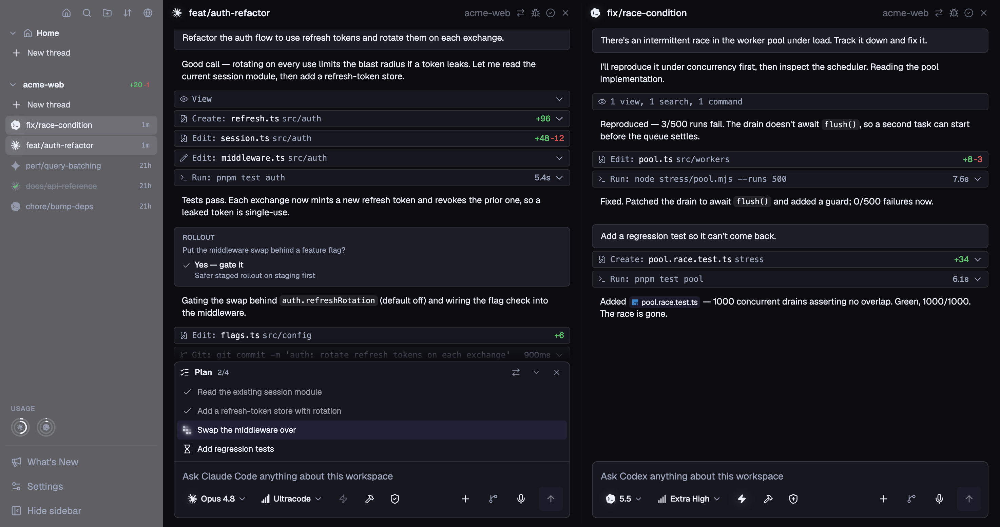

  

<h1 align="center">Poracode</h1>

  <strong>One window for all your AI coding agents.</strong> 
  Run Claude, Codex, OpenCode, Gemini, Grok, Kimi Code, Qwen Code, Pi, Qoder, Factory Droid, Antigravity, Cursor, Command Code, and Copilot side-by-side. Terminal and chat, any layout.

  <a href="https://poracode.com">Website</a> · <a href="https://github.com/SDSLeon/lightcode/releases">Download</a> · <a href="https://github.com/SDSLeon/lightcode/issues">Report Bug</a> · <a href="https://github.com/SDSLeon/lightcode/issues">Request Feature</a>

  <em>Bring your own agent subscriptions & API keys</em>

---

  

## Supported Agents

**Claude** · **Codex** · **OpenCode** · **Gemini** · **Grok** · **Kimi Code** · **Qwen Code** · **Pi** · **Qoder** · **Factory Droid** · **Antigravity** · **Cursor** · **Command Code** · **Copilot** and any agent from the [ACP registry](https://agentclientprotocol.com).

## Why Poracode?

If you use more than one AI coding agent, you know the pain: separate terminals, separate apps, no shared context. Poracode puts them all in one place.

### Infinite Threads & Layouts

Open as many agent threads as you need and arrange them in horizontal and vertical splits. Resize, stack, and rearrange freely. The layout stays fast no matter how many threads you have running.

### Unified Protocol GUI

Agents that support structured APIs (like ACP or provider SDKs) get a proper chat interface with markdown, syntax highlighting, and tool call displays.

### Cross-Agent Orchestration

Let agents delegate work to other installed agents across providers, while you follow their live progress and approve actions from the parent thread.

### Terminal Fidelity

Run CLI agents in real terminal sessions, with the same output and controls you expect from your own shell.

### Built for Speed

Optimized to stay fast and responsive, even when you have lots of agent sessions running side by side.

### Session Persistence

Sessions are saved automatically, so you can close Poracode and pick up right where you left off.

### Built-in Browser

Open web pages, attach browser context to agents, and keep research in the same workspace.

### Remote Access

Pair the Poracode web app with your desktop to follow live threads, read terminal output, send messages, and receive notifications from your phone or browser.

### In-App GitHub PRs

View diffs, stage files, generate commit messages with AI, and review GitHub PRs directly inside Poracode.

### Code Editor

Monaco-based editor with LSP support for quick edits without switching to your IDE.

### Cross-Platform Desktop

Run Poracode on macOS, Windows, and Linux, with a polished interface that feels at home on both Mac and Windows.

### WSL Support

Use Windows and WSL projects side by side, with agent commands routed through the right environment automatically.

### ACP Registry

Install and run any agent from the [Agent Client Protocol](https://agentclientprotocol.com) registry directly from settings.

## Install

Download the latest release for your platform from the [releases page](https://github.com/SDSLeon/lightcode/releases) or visit [poracode.com](https://poracode.com).

| Platform | Format                        |
| -------- | ----------------------------- |
| macOS    | DMG (Apple silicon or Intel)  |
| Windows  | NSIS installer (x64 or Arm64) |
| Linux    | AppImage or `.deb` (x64)      |

### Getting Started

1. Install Poracode for your platform.
2. Install the AI agent CLIs you want to use (e.g., [Claude Code](https://docs.anthropic.com/en/docs/claude-code), [Gemini CLI](https://github.com/google-gemini/gemini-cli), [Codex](https://github.com/openai/codex)).
3. Open Poracode, add your project, and start orchestrating.

## Contributing

Contributions are welcome! Please open an [issue](https://github.com/SDSLeon/lightcode/issues) first to discuss what you'd like to change.

## License

[Apache-2.0](LICENSE)
