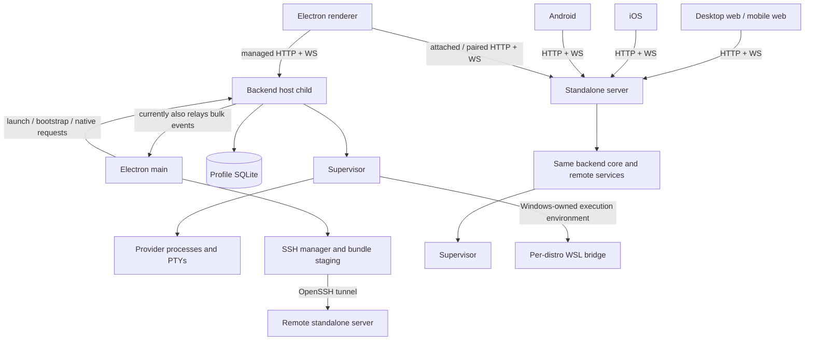
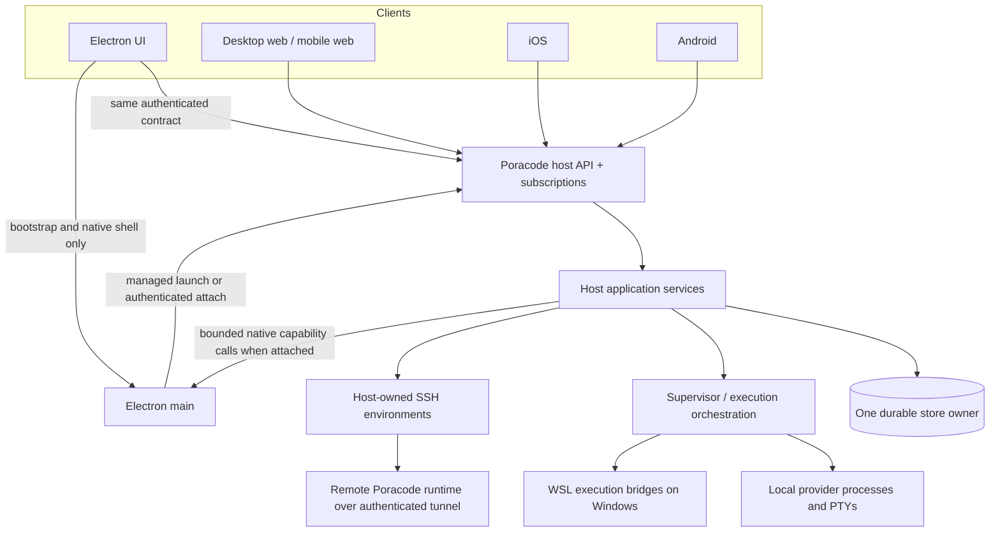

# Poracode v2 — Server Architecture and Production Readiness

Status: active implementation and qualification; refined 2026-09-22 UTC. **About 80% of the overall goal is achieved; this is not a production-ready declaration.**

Original audit: `36e1649f017aeccebc202bb9d5c9c6ab0f797709` (`poracode/v2`). The main architecture delta was reconciled into seven scoped implementation/parity commits from `7e9cf2a28` through `80eae5304`, followed by documentation and smoke-harness commit `3811d2485`. Later exact-head CI and Git-burst corrections are grouped into typed-admission, packaging, native and qualification commits from `bad62fa9e` through `3206de989`. Artifact identities below pin the qualified earlier candidate bytes; they do not silently qualify these later source commits.

Section 0 is the current execution plan and completion assessment. Sections 1–2 preserve the original audit as historical rationale; their descriptions of missing features and old paths must not be read as current implementation status. Sections 3–11 retain the architectural constraints and acceptance contract, amended by section 0. Detailed evidence and earlier failures remain in the [execution log](V2_SERVER_ARCHITECTURE_EXECUTION_LOG.md).

## 0. Current goal, evidence and remaining delivery plan

### 0.1 Refined goal and scope

Finish the existing shared-server architecture, without a rewrite: Electron automatically starts its managed server while preserving existing desktop lifetime behavior; Electron, desktop/mobile web, iOS and Android consume the same authenticated host authority; independent and remote servers support multiple clients; the packed `poracode` CLI starts its compatible standalone server/web bundle outside a checkout. SSH environments and WSL retain explicit ownership, trust, cancellation and lifecycle boundaries.

Completion requires **correct behavior, measured responsiveness within a declared workload envelope, qualified artifacts, and a reviewed commit/push**. It does not mean moving native window/dialog operations out of Electron, promising unlimited processes, or splitting cohesive files to an arbitrary size. Every additional change must remove a demonstrated defect, duplicated responsibility, blocking operation or required evidence gap.

Use Crossagents **z.ai GLM 5.3 Flash High** for independent research, disjoint implementation and verification. The coordinator validates results against actual files/tests/runtime; confident reports and wired CI jobs do not close gates. Preserve the active goal; this refinement changes its acceptance detail, not its intended product.

### 0.2 Honest progress estimate

| Component of the goal                           | Weight | Estimated completion | Basis / remaining work                                                                                                                                                                                                                                                          |
| ----------------------------------------------- | -----: | -------------------: | ------------------------------------------------------------------------------------------------------------------------------------------------------------------------------------------------------------------------------------------------------------------------------- |
| Architecture and implementation                 |    70% |                 ~92% | Core separation, bounded transport/storage/catalog work, environment ownership, packaging and native adoption are largely implemented. R1/R2/B7 and typed Git pressure propagation are implemented and independently reviewed; the source delta is grouped into scoped commits. |
| Required production qualification               |    25% |                 ~48% | Full mock Electron, macOS install/CLI, production compact-web and a real local Git-burst cell pass. Earlier exact-artifact multi-host evidence also passes. Soak, final artifacts, native devices, Windows/WSL, other targets and published N−1 remain open.                    |
| Final reconciliation, coherent commits and push |     5% |                 100% | The main delivery was previously pushed and verified. The later correction set is split into reviewable commits and must receive its own exact-head push/CI proof; until then its local verification is not release proof.                                                      |

Weighted estimate is approximately `70% × 92% + 25% × 48% + 5% × 100% = 81%`, reported conservatively as **about 80%**, with a reasonable **75–85% range**. These are planning estimates based on delivered behavior and missing evidence, not measured percentages of code or remaining elapsed time. There is no trustworthy completion date from the test count or file count. No percentage waives a mandatory release gate.

### 0.3 What is verified, and what that evidence does not prove

- **Code checkpoint:** follow-up code head `3206de989` passes 1,536 test files and 17,128 tests, with five files and 99 tests skipped. Whole typecheck/lint/format, the remote-v3 generated-output check, packaging/workflow regressions and Android instrumentation compilation pass. The earlier localization extraction reports all 12 non-English catalogs at zero missing; this follow-up adds no localized strings.
- **Frozen Electron checkpoint:** the final source candidate passes the full deterministic mock smoke, including Settings persistence, control geometry, schedules, GitHub Actions, search, Browser and mock integrations, with zero console/runtime errors. The first run exposed a real whole-document settings write race; the serialized/coalescing writer regression and the fresh rerun pass. Report: `~/.poracode-smoke/automated-1790046522224-54994/artifacts/smoke-report.json`. This remains development mock evidence, not real-provider or capacity proof.
- **Production standalone checkpoint:** build05 source `543cc432cf3bb1ccf5b25e30b3740c6b7181283f9c6a67c5573f02767586ca1e`; macOS arm64 tarball `eaa97bef4eac26c609cda003699256a842a08857d96e6def59060219a160c475`; web payload `0bb18f7fb285bfd5c5364edd2ff5c3c605532de51d425887876005ce65d8dc7d`. Out-of-checkout install, real-tarball CLI qualification, upgrade ownership and byte verification pass: 1,680 shipped files match, with 1,747 AppleDouble metadata records accounted separately. This is not npm publication, all-platform qualification or published N−1 proof.
- **Actual multi-host checkpoint:** the frozen Electron app and exact installed standalone server pass all seven coexistence/order/restart/reconnect/shutdown-isolation scenarios, with nonempty sidebar DOM assertions. Thread fixtures are inert; this does not prove provider execution under load.
- **Verified client journey:** build05 production Chrome passes all 22 desktop and true 390×844 compact steps: pairing, saved connection, authoritative Online, away/back, reload, verified stop/Offline, restart/Online and Projects, with zero console/React errors. Teardown proves owned processes exited and both ports closed. Report: `tmp/v2-production/glm-production-mobile-web/run-2026-09-22T03-21-37/report.md`.
- **Performance:** instrumentation and positive controls were corrected. Re-analysis of the frozen calibration proves the earlier 172-entry “unread loss” was an accounting error: those records were retained before the phase, and the current ordinal/delta implementation accounts for the 453 in-phase samples with zero unread loss. A focused real-host Git-burst cell now passes four scenarios, preserves typed overload outcomes and keeps the control path bounded while a fetch stalls. The broader run still had foreign workload contamination, so no supported thread-count or general latency claim has been earned yet.

Evidence locations and historical failure details are in the execution log. The tested release artifacts above precede the latest typed-admission, packaging and native CI corrections. A newly built exact-source artifact and exact-head CI must replace those checkpoints before release.

### 0.4 Findings that change the remaining work

| ID                               | Finding and benefit of fixing it                                                                                                                         | Current state                                                                                                                                                                                                                         | Required exit evidence                                                                                                                                                                                                                                         |
| -------------------------------- | -------------------------------------------------------------------------------------------------------------------------------------------------------- | ------------------------------------------------------------------------------------------------------------------------------------------------------------------------------------------------------------------------------------- | -------------------------------------------------------------------------------------------------------------------------------------------------------------------------------------------------------------------------------------------------------------- |
| R1 — Procedure authority         | Generic remote dispatch admitted main-local names and cast them to supervisor procedures. Live `dbDeleteThread` and latest-goal calls returned HTTP 500. | Implemented and independently reviewed: passthrough is supervisor-only; nine names are local/unsupported remotely and three derived reads use existing bounded history. Generated/native mirrors and version disposition are current. | Exhaustive transport/handler-owner check; real host tests of each retained operation; obsolete entries removed from generated contracts/consumers with deliberate version disposition. No IPC data-plane fallback.                                             |
| R1a — Redundant goal read        | Bounded history already carries the latest goal, including one outside the tail. A second legacy read fails and marks successful hydration as failed.    | Narrow correction implemented; real HTTP/SQLite regression fails before and passes after; 56 adjacent tests pass.                                                                                                                     | Final candidate reopening a long-history goal thread hydrates successfully with no legacy request; no new goal endpoint.                                                                                                                                       |
| R2 — Uncertain launch identity   | After an uncertain start with no host row, navigating away let catalog reconciliation remove the optimistic row and retained command ID/body.            | Implemented and independently accepted: only replay-bearing uncertain episodes protect rows; exact ID/body survive navigation and deletion passes; retry completion, explicit removal and authoritative deletes release retention.    | Catalog absence cannot retire an unresolved operation; navigation/reconnect/retry preserves the exact ID/body; authoritative resolution and explicit deletion release retention. Test the absent-host-row case, not only a lost response with a persisted row. |
| R3 — Test authority and UI state | Hidden windows stalled exit animations; renderer-only voice fixtures were correctly removed as absent. These produced misleading smoke failures.         | Visibility precondition, replacement typing, owner-backed voice fixture and normal host-command cleanup are implemented; full mock smoke passes.                                                                                      | Keep original failures and the demonstrated explanations. Tests must not fake hydration, pin nonexistent rows forever or weaken assertions to pass.                                                                                                            |
| R4 — Final cross-client behavior | Unit/native compilation and generated parity do not prove actual user journeys on the final artifact.                                                    | Production desktop and true compact-web connection/recovery journeys pass on build03; final-byte reruns and current native/device/provider journeys remain open.                                                                      | Pair, reload, offline/reconnect, long history/pagination, notices, permissions, experiment lifecycle and multi-client authority on each claimed client/mode.                                                                                                   |
| R5 — Capacity and fault envelope | The central responsiveness promise remains unmeasured under clean representative load.                                                                   | Harness calibrated; quiet matrix and soak pending.                                                                                                                                                                                    | Section 4 matrix with valid trusted-input populations, no unaccounted sample loss, process/hop counters, positive control, quiet-host provenance, 30-minute sustained run and overnight soak.                                                                  |
| R6 — Final delivery              | A large dirty tree and stale planning text make review and release provenance hard to assess.                                                            | Main delivery is complete; the follow-up is independently reviewed and grouped into typed-admission, packaging, native and qualification commits.                                                                                     | Push the follow-up normally, require exact-head CI, and tie the next runbook checkpoint to newly built bytes.                                                                                                                                                  |

The procedure findings do **not** justify another transport framework. The history fix should remove a redundant call. The uncertain-launch fix should extend the existing operation lifetime rule, not introduce a second retry store. Extract newly touched responsibilities when that reduces coupling; preserve compatibility code with real consumers.

### 0.5 Revised execution order and stop conditions

1. **Close R1/R2 correctness holes first.** Complete the procedure-owner inventory, retain/map only valid operations, remove the redundant goal read, and protect unresolved launch identity. Add realistic regressions at actual owner/transport boundaries; review mocks that had accepted impossible supervisor calls. Update protocol/generated/native mirrors only where the chosen change requires it. Then capture the small Git-burst baseline and implement B7's shared admission before freezing the final candidate; preserve the source-before/source-after evidence.
2. **Freeze one corrected candidate.** Record source, dirty-tree and artifact hashes after all source owners release their files. Run invalidated focused checks, then one reconciled required suite/codegen/localization checkpoint. Preserve the original staged work and unrelated concurrent changes. Do not rebuild repeatedly while known fixes are still outstanding.
3. **Qualify real behavior on those bytes.** Re-run affected Electron and standalone journeys; finish production web/PWA and native parity, experiment create/launch/cancel/cleanup/reload, shared SSH ownership and current-artifact recovery. Distinguish real PTY/provider/device evidence from mocked provider gates. Every run cleans up only its owned processes/profiles and verifies exit/port closure.
4. **Measure, then decide whether more optimization is justified.** Run a quiet small reference cell with a positive control and complete input samples before spending time on the full section 4 matrix. Include the Git burst and event-amplification checks in §0.6 and qualify B7 on the frozen candidate. Freeze budgets; report unsupported/no-sample results honestly. Escalate to another DB worker, reducer offload or scoped replay protocol only if measured bounded work still misses the budget. Any resulting source correction invalidates affected artifact evidence and requires a new freeze. Complete sustained/overnight runs only after functional gates are stable.
5. **Close platform and upgrade evidence.** Obtain Windows 11 x64 + at least two WSL2 distributions, NAT/mirrored networking, required physical iPhone/lower-end Android coverage, other advertised standalone targets, and a real published supported N−1 artifact. Android support is the maintained API 34–37 window, with the floor advanced when the current Android Security Bulletin or pinned platform dependencies stop supporting it; no legacy lane below the maintained floor. Local mocks and same-tarball reinstall do not substitute. Missing environments remain explicit open gates; narrow a claimed support matrix only by an explicit product decision.
6. **Review, commit and push.** Reconcile independent findings without restarting unrelated reviews. Use reviewable slices such as trust/lifecycle, transport, host authority, packaging, native/parity and docs; keep migrations/generated mirrors with their corresponding change. Commit/push is already authorized. Verify branch/remote and the published commits, and report any remaining release limitations.

**Close the active goal only when:** no validated in-scope Important defect remains; required final-candidate checks and claimed client/platform/load gates pass (or the user explicitly changes the scope); supported modes and limits are documented; and the requested commits/push are verified. A green mock smoke, a large passing test count, a wired CI job or a high progress estimate alone is not completion.

### 0.6 t3code comparison — 2026-09-22 UTC

Compared the linked implementation thread `989aec99-7d92-4a35-9ce4-7735a0b7d835`, its Poracode comparison checkpoint and t3code `main` at [`76cc9b08f19d89012f16d18f47478c4f7b9b0a6f`](https://github.com/pingdotgg/t3code/commit/76cc9b08f19d89012f16d18f47478c4f7b9b0a6f). Sources below are pinned to those inspected bytes. This is a source comparison, not a comparative benchmark. Reviewed Poracode file hashes and pre-edit plan/log copies are retained in `tmp/t3code-source-review/review-checkpoint.json` and its directory.

**Keep the existing split.** t3code's [ownership model](https://github.com/pingdotgg/t3code/blob/76cc9b08f19d89012f16d18f47478c4f7b9b0a6f/docs/internals/overview.md) puts execution and authoritative state on the server, with shared client connection/domain services and platform adapters. Poracode already follows that direction. Its native Swift/Kotlin clients should continue sharing generated contracts and behavioral fixtures; adopting Effect RPC, event sourcing or a shared mobile UI would not close our demonstrated gaps.

| Comparison                                                                                                                                                                                                                                                                                                                                                                                                                                                                                                   | Current Poracode evidence                                                                                                                                                                                                                                                                                                                                                                                       | Plan disposition                                                                                                                                                                                                                                                                                                                                                                               |
| ------------------------------------------------------------------------------------------------------------------------------------------------------------------------------------------------------------------------------------------------------------------------------------------------------------------------------------------------------------------------------------------------------------------------------------------------------------------------------------------------------------ | --------------------------------------------------------------------------------------------------------------------------------------------------------------------------------------------------------------------------------------------------------------------------------------------------------------------------------------------------------------------------------------------------------------- | ---------------------------------------------------------------------------------------------------------------------------------------------------------------------------------------------------------------------------------------------------------------------------------------------------------------------------------------------------------------------------------------------- |
| t3code has a process-wide short-Git semaphore. [PR #11405](https://github.com/pingdotgg/t3code/pull/11405), merged September 15, caps short commands across sessions; the [current driver](https://github.com/pingdotgg/t3code/blob/76cc9b08f19d89012f16d18f47478c4f7b9b0a6f/apps/server/src/vcs/GitVcsDriverCore.ts) uses eight permits and bypasses them for long/unlimited timeouts.                                                                                                                      | Fail-before evidence allowed 12 concurrent WSL Git starts and a 21-command batch. B7 now provides per-supervisor short/long admission, aggregate bounded queues, typed wait/overflow/cancel outcomes, exact release, authoritative diagnostics, and same-class chunking for unbounded WSL worktree batches.                                                                                                     | **Implemented and locally qualified:** focused/neighboring checks and the four-scenario real-host Git-burst cell pass after typed pressure was preserved through HTTP. Windows/WSL runtime evidence and the broader quiet capacity/soak matrix remain required.                                                                                                                                |
| t3code [separates shell summaries from selected-thread streams](https://github.com/pingdotgg/t3code/blob/76cc9b08f19d89012f16d18f47478c4f7b9b0a6f/apps/server/src/ws.ts). Shell changes coalesce over 50 ms; thread replay counts the requested thread's rows within a captured head instead of treating a global sequence gap as that thread's backlog.                                                                                                                                                     | [`itemInterestFilter`](../src/host/remote/server/itemInterestFilter.ts) correctly removes hidden bulk, but deliberately retains empty continuity envelopes. [`remoteAccessServerEvents`](../src/host/remote/remoteAccessServerEvents.ts) filters and may serialize per socket. Zero hidden payload is not zero fan-out/parse work.                                                                              | **Strengthen A1/B3 measurement:** record empty frames, summary publications, serialization calls and recipient CPU as hidden streams and clients grow. Reuse identical authorized projections/coalesce safe summaries first. Scoped cursors or sequence-range frames remain conditional on measured failure and require negotiated wire/native migration; never simply drop continuity frames. |
| t3code's [live budget](https://github.com/pingdotgg/t3code/blob/76cc9b08f19d89012f16d18f47478c4f7b9b0a6f/apps/server/src/orchestration/LiveStreamBudget.ts) includes batches awaiting RPC acknowledgement and releases upstream work when a subscriber overflows. Its [tool-update coalescer](https://github.com/pingdotgg/t3code/blob/76cc9b08f19d89012f16d18f47478c4f7b9b0a6f/apps/server/src/orchestration/ThreadLiveEventCoalescer.ts) replaces only identified updates and preserves ordering barriers. | [`remoteAccessServerWs`](../src/host/remote/remoteAccessServerWs.ts) already retains byte reservations until write completion/close; [`runtimeWriteQueue`](../src/host/db/runtimeWriteQueue.ts) coalesces ordered deltas, and [`runtimeStreamStore`](../src/host/db/runtimeStreamStore.ts) avoids rewriting the whole growing transcript.                                                                       | **Retain those implementations; strengthen B1/B3 proof:** account for queued, coalescing, executing and transport-held work, and test tiny-delta write/publication amplification. A depleted queue alone is not completion; replacing text or dropping canonical events is not safe coalescing.                                                                                                |
| t3code's [connection runtime](https://github.com/pingdotgg/t3code/blob/76cc9b08f19d89012f16d18f47478c4f7b9b0a6f/docs/internals/connection-runtime.md) separates transport readiness from data synchronization. Its [thread state](https://github.com/pingdotgg/t3code/blob/76cc9b08f19d89012f16d18f47478c4f7b9b0a6f/packages/client-runtime/src/state/threads.ts) keeps applied state and cursor together, cancels the last consumer's stream, and retains a separate idle resume cache.                     | [`rendererEventInterests`](../src/renderer/state/rendererEventInterests.ts) already reference-counts interests with a release grace; [`chatRuntimePersister`](../src/renderer/state/chatRuntimePersister.ts) has bounded inactive history and cursor invalidation. The thread's failed redundant goal read demonstrates why successful transport/history and failed auxiliary work must remain distinguishable. | **Strengthen A4/B4 acceptance**, not another connection/cache layer: healthy socket plus failed history, navigation during apply/page load, old-generation cache writes, capability downgrade and foreground storms. Keep bounded cache policy; do not copy a five-minute TTL without aggregate byte limits.                                                                                   |

Additional compatibility lesson: t3code's latest history includes [a startup fix for persisted events missing a newer field](https://github.com/pingdotgg/t3code/commit/80d9c181). Extend D4's real N−1 gate to open representative pre-upgrade runtime items, receipts and resumable state, not only migrate tables or exchange current messages. This does not imply Poracode has the same defect. Our migration-aware staged upgrade and explicit forward-only recovery policy already address the main update boundary; do not replace them with another launcher during this work.

These additions refine existing correctness/load gates. **Only B7 was a newly identified implementation gap.** It is now implemented, independently accepted and locally exercised after correcting the first review's multi-worktree and error-propagation findings. The other comparisons remain measurement and regression requirements; change code only where they reveal a failure. The overall estimate remains about 80% because the external platform, artifact, soak and upgrade gates still dominate the unfinished work.

## 1. Architectural verdict — original audit

**Keep the architecture. Finish its ownership boundaries and enforce bounded work.** A rewrite, a new RPC stack, a new database, or a shared cross-platform UI framework would add risk without addressing the most important findings.

The product already has the right foundation:

- A shared backend core owns persistence and supervisor lifetime.
- Real provider processes and PTYs belong to the supervisor.
- Managed desktop and standalone use the same remote server and contract.
- Electron has an explicit host transport; preload is intended for bootstrap and local shell operations.
- Owner leases, data fences, authenticated discovery, snapshot recovery, terminal cursors, generated native bindings and native vaults already exist.
- Browser, mobile web, iOS and Android are genuine clients, with native clients retaining native UI.

But the central performance claim is not yet established. There are concrete remaining paths that scale client/main-process work with unrelated thread output:

1. **Managed Electron does not send runtime thread interests on its WebSocket.** The server consequently treats it as interested in every thread's runtime content.
2. **The backend still sends watched bulk supervisor events to Electron main**, after delivering them over WebSocket. Main largely discards that payload after decoding it.
3. **Managed Electron parses frames synchronously in the renderer**, while remote clients have an existing worker path.
4. Worker failure, full queue drains, metadata persistence, host database flushing and SSH setup still have synchronous or insufficiently bounded paths.
5. The current input-latency observer expects a nonstandard property and can silently miss real samples.

These are more valuable to fix than another round of directory renaming.

At the original audit, the deployment product was unfinished: the repository did not yet ship a publishable `npx poracode` executable; the standalone tarball lacks a bundled web application; qualified and released server artifacts are assembled differently; SSH connection ownership is still largely device-local.

The intended promise should be:

> Each client performs bounded work for the content it actually displays. Background threads do not send their bulk output to uninterested clients. Within a published workload envelope, user interactions and control actions remain responsive. Above that envelope, the system applies explicit backpressure or rejects new work without freezing clients or losing accepted durable work.

“No matter how many threads” cannot mean unlimited CPU, memory or processes. It can mean that adding hidden threads does not create proportional rendering work, and that saturation is controlled and observable.

## 2. Original audited architecture (historical baseline)

### 2.1 Process and connection map



This diagram highlights ownership and the remaining unwanted relay. It does not imply that every Electron request passes through main, or that all standalone services execute in the supervisor.

### 2.2 Source-backed findings

Priorities mean: **P0** protects the central responsiveness/safety claim; **P1** completes the stated product or its production guarantees; **P2** is a targeted improvement after the preceding evidence, not permission for an arbitrary rewrite. Performance cost is code-derived unless explicitly measured.

| Finding                                                                | Evidence at the audited revision                                                                                                                                                                                                                                                 | Consequence                                                                                       | Work item |
| ---------------------------------------------------------------------- | -------------------------------------------------------------------------------------------------------------------------------------------------------------------------------------------------------------------------------------------------------------------------------- | ------------------------------------------------------------------------------------------------- | --------- |
| Managed socket omits runtime interests                                 | [desktopLoopbackIntake.ts:272](../src/renderer/state/remoteServers/desktopLoopbackIntake.ts#L272), [preloadIpcTransport.ts:109](../src/renderer/hostTransport/preloadIpcTransport.ts#L109), [remoteAccessServerEvents.ts:95](../src/host/remote/remoteAccessServerEvents.ts#L95) | One managed window broadens upstream interests and receives offscreen runtime content             | A1        |
| Bulk events still cross backend → main                                 | [backend/index.ts:177](../src/backend/index.ts#L177), [supervisorEventRelay.ts:30](../src/backend/supervisorEventRelay.ts#L30), [BackendDesktopServices.ts:305](../src/backend/BackendDesktopServices.ts#L305)                                                                   | Redundant serialization, allocations and main-process work                                        | A2        |
| Managed frame decoding is synchronous                                  | [desktopLoopbackIntake.ts:328](../src/renderer/state/remoteServers/desktopLoopbackIntake.ts#L328)                                                                                                                                                                                | UI-thread work grows with incoming frame volume                                                   | A3        |
| Input timing observer requires `processingDuration`                    | [rendererPerfDiagnostics.ts:479](../src/renderer/diagnostics/rendererPerfDiagnostics.ts#L479)                                                                                                                                                                                    | Real Event Timing samples can be silently skipped                                                 | A0        |
| Managed connection has no open deadline/health policy equivalent       | [desktopLoopbackIntake.ts:272](../src/renderer/state/remoteServers/desktopLoopbackIntake.ts#L272), [eventSocketSession.ts](../src/renderer/state/remoteServers/eventSocketSession.ts)                                                                                            | Hung opens, half-open connections and slow local recovery                                         | A4        |
| Sleep-state changes reread settings synchronously                      | [desktopAppShell.ts:43](../src/main/desktopAppShell.ts#L43), [sharedSettingsFile.ts](../src/host/sharedSettingsFile.ts)                                                                                                                                                          | File I/O and JSON parsing on a main-process hot path                                              | A5        |
| Shared worker admission/failure affects multiple hosts                 | [clientEngineHost.ts](../src/renderer/state/remote/engine/clientEngineHost.ts), [eventSocketEngine.ts](../src/renderer/state/remoteServers/eventSocketEngine.ts)                                                                                                                 | A noisy host can trigger other hosts' recovery; failure can synchronously replay parse work on UI | A3        |
| Runtime persistence queue is unbounded and drains synchronously        | [runtimeWriteQueue.ts:27](../src/host/db/runtimeWriteQueue.ts#L27), [runtimeItems.ts:210](../src/host/db/runtimeItems.ts#L210)                                                                                                                                                   | Backlog growth/storage failures can stall the server control loop                                 | B1        |
| In-progress command receipts are deleted on startup                    | [connection.ts:293](../src/host/db/connection.ts#L293), [httpRouteHandlers.threads.ts:80](../src/host/remote/server/httpRouteHandlers.threads.ts#L80)                                                                                                                            | Crash after an external side effect can make a retry execute it again                             | B2        |
| Receipt identity does not generally bind request content               | [remoteCommandReceipts.ts:31](../src/host/db/remoteCommandReceipts.ts#L31)                                                                                                                                                                                                       | Reusing a key with a different body can replay a stale result                                     | B2        |
| HTTP fairness is socket-based; WS count lacks a principal gate         | [RemoteAccessServer.ts:276](../src/host/remote/RemoteAccessServer.ts#L276), [wsConnections.ts:205](../src/host/remote/server/wsConnections.ts#L205)                                                                                                                              | Many sockets can bypass fairness or multiply aggregate memory                                     | B3        |
| Ordinary read contracts retain unbounded legacy variants               | [snapshots.ts:145](../src/host/remote/server/snapshots.ts#L145), [snapshots.ts:335](../src/host/remote/server/snapshots.ts#L335)                                                                                                                                                 | Large catalog/history and reconnect storms can dominate response work                             | B4        |
| Browser metadata cache writes are synchronous                          | [dbStorage.ts:73](../src/renderer/state/dbStorage.ts#L73)                                                                                                                                                                                                                        | Large project/thread catalogs can block interaction during persistence                            | B5        |
| iOS follow-up queue recovery buffer is unbounded                       | [RichChatTranscriptController.swift:283](../ios/App/App/Features/RichChat/Controllers/RichChatTranscriptController.swift#L283)                                                                                                                                                   | Delayed history can accumulate redundant replace-state messages                                   | B6        |
| SSH is composed in main and stages archives synchronously              | [desktopAppReady.ts:147](../src/main/desktopAppReady.ts#L147), [SshConnectionManager.ts:255](../src/host/ssh/SshConnectionManager.ts#L255), [runtimeBundle.ts](../src/host/ssh/runtimeBundle.ts)                                                                                 | Cold SSH connection can block desktop shell work                                                  | C1/C3     |
| Headless SSH capability has no corresponding remote management API     | [procedures/ssh.ts](../src/shared/ipc/procedures/ssh.ts), [remoteProcedureRoutes.ts:251](../src/renderer/remoteProcedureRoutes.ts#L251), [headlessRemoteComposition.ts:277](../src/server/headlessRemoteComposition.ts#L277)                                                     | Web/native clients cannot manage a server-owned SSH environment through the advertised capability | C1        |
| SSH bootstrap signals unverified persisted PIDs                        | [sshRemoteScripts.ts:212](../src/shared/sshRemoteScripts.ts#L212)                                                                                                                                                                                                                | Stale PID reuse can terminate an unrelated process; connection can interrupt an existing owner    | C2        |
| WSL staging performs synchronous UNC operations                        | [wslDeploy.ts](../src/supervisor/wsl/wslDeploy.ts), [wsl/runtime/index.ts:316](../src/supervisor/wsl/runtime/index.ts#L316)                                                                                                                                                      | A slow distro/filesystem can stall unrelated supervisor sessions                                  | C4        |
| No publishable npm executable; no standalone web assets                | [package.json](../package.json), [assemble-server-tarball.mjs](../scripts/assemble-server-tarball.mjs), [staticClientApp.ts:25](../src/host/remote/staticClientApp.ts#L25)                                                                                                       | `npx poracode` and self-contained browser entry are not delivered by the current artifacts        | D1/D2     |
| Release assembly differs from qualification                            | [_build.yml](../.github/workflows/_build.yml), [native-ci.yml](../.github/workflows/native-ci.yml)                                                                                                                                                                               | Passing a specially assembled CI artifact does not qualify the released artifact                  | D3        |
| Upgrade checks HTTP liveness rather than expected owner/build identity | [serverUpgrade.ts](../src/server/serverUpgrade.ts), [httpRouteHandlers.ops.ts:10](../src/host/remote/server/httpRouteHandlers.ops.ts#L10)                                                                                                                                        | A healthy response can come from the wrong release; code rollback does not reverse data migration | D4        |
| Shutdown errors clear the hard exit deadline                           | [cliRuntime.ts:56](../src/server/cliRuntime.ts#L56)                                                                                                                                                                                                                              | Surviving handles can leave a failed daemon alive indefinitely                                    | D5        |

The table records gaps at the original audited revision, not the current implementation state or a claim that V5/V6 accomplished nothing. In particular, removing the old renderer IPC delivery path was useful; it did not remove the remaining backend-to-main copy.

## 3. Target architecture and ownership

### 3.1 One host implementation, explicit launch modes



This is a responsibility diagram, not a mandate to collapse all host services into one event loop. Keep the existing host/supervisor separation. Isolate the single database owner further only if the bounded-write design still misses measured budgets.

The same core must support:

| Mode                               | Who starts/owns the server                       | Closing this client                                | Required behavior                                                                             |
| ---------------------------------- | ------------------------------------------------ | -------------------------------------------------- | --------------------------------------------------------------------------------------------- |
| Managed desktop                    | Electron launches the bundled host automatically | Preserve current managed-desktop shutdown behavior | No manual server setup; wait for ready state; show a responsive shell during startup/recovery |
| Desktop attached to existing owner | Existing server retains ownership                | Disconnect only                                    | No duplicate database, supervisor, credentials or shutdown authority                          |
| Desktop using a remote server      | Remote operator/service owns it                  | Disconnect only                                    | Native shell remains local; project/agent operations execute on selected remote host          |
| Web/PWA/iOS/Android                | Existing managed or standalone server            | Disconnect/suspend only                            | Multiple clients share authoritative state and independently select visible content           |
| `npx poracode`                     | Foreground CLI owns the standalone lifecycle     | Browser/client closure has no effect               | Ctrl-C performs bounded drain; service installation is a separate explicit operation          |
| Persistent installed service       | Service manager owns it                          | No effect                                          | Restart policy, profile paths, credentials, logs and upgrades are operationally explicit      |

Do not silently make desktop-owned sessions survive quitting the app. An optional “keep server running” product mode needs an explicit service-ownership handoff and its own acceptance tests; it is not necessary to preserve the current desktop experience.

### 3.2 Put work with its authority

| Concern                                                                                        | Owner                                            | What the client keeps                                                                                  |
| ---------------------------------------------------------------------------------------------- | ------------------------------------------------ | ------------------------------------------------------------------------------------------------------ |
| Threads, projects, histories, settings shared by devices, schedules, usage, operation receipts | Selected host                                    | Bounded projections, selections and revision-aware caches                                              |
| Agent processes, PTYs, Git operations, project files, tool execution                           | Selected host's supervisor/execution environment | Input, visible output, pending command identity                                                        |
| Provider credentials and host-owned SSH credential references                                  | Host credential authority                        | Permission to request an operation, never implicit copies of secrets                                   |
| Pairing credentials and device-local SSH tunnel credentials                                    | Device secure storage                            | Its own revocable session and local connection configuration                                           |
| Window, tray, clipboard, native file chooser, OS integration, client auto-update               | Client/native shell                              | Local state; narrow typed adapter calls                                                                |
| Browser/computer-use capabilities requiring Electron APIs                                      | Explicit attached native adapter                 | UI/native API work only; heavy processing outside main                                                 |
| Formatting, selection, accessibility, scroll, focus, animations, gestures                      | Client                                           | These remain local; server ownership is not a reason to put interaction round trips on every keystroke |

“Everything on the server” means all authoritative application work and execution. It does not mean server-side React state, remote clipboard ownership, or eliminating legitimate low-volume asynchronous native IPC.

### 3.3 Keep three connection concepts distinct

1. **Paired server:** an independently owned authority with a stable host identity, profile and session. Connecting does not install or upgrade it.
2. **Host-owned SSH environment:** a shared execution target managed from the selected server. Stable environment ID, trust, credential references, runtime and lifecycle belong to that server.
3. **Device-owned SSH tunnel:** a local connectivity adapter to an existing server, using that device's credentials. Closing the tunnel never means stopping the remote server.

A tunnel listening on the server's `127.0.0.1` is not reachable at the browser's `127.0.0.1`. Host-owned SSH therefore requires a scoped environment route/proxy through the parent host, or a separately client-reachable paired endpoint. Never solve this by leaking tunnel endpoints, sending host SSH keys to clients, or silently flattening the child host's authorization into the parent session.

WSL is an execution environment of a Windows host. A server intentionally started inside WSL is simply another Linux server. Do not create a full independent server/profile for every distro as a cleanup exercise.

## 4. Responsiveness and capacity contract

### 4.1 Measurement must precede architectural performance claims

Fix the Event Timing adapter first. Use `processingEnd - processingStart`, distinguish input delay from handler time and interaction-to-paint, and record sample count and unavailable states. Configure an explicit supported threshold; the default observer threshold does not measure every interaction. Use real trusted clicks/typing rather than a JavaScript `dispatchEvent` proxy. These fields and sampling limitations are defined by the [W3C Event Timing draft](https://www.w3.org/TR/event-timing/#sec-performance-event-timing).

Extend the existing diagnostics and load fixtures; do not build a competing observability framework. Record process CPU/RSS, loop delay, IPC/WS bytes, queue bytes/age, frame decode/reduce/paint costs and command latency with a shared run ID. Node provides event-loop monitoring through [perf_hooks](https://nodejs.org/docs/latest-v24.x/api/perf_hooks.html). Keep prompts, output text, tokens and private paths out of performance telemetry.

Current synthetic tests are useful regressions, but not GUI responsiveness evidence. `remoteProtocol.perf.test.ts` exercises six threads and a generous total wall-time limit. `sharedHostLoadProfile.test.ts` uses protocol clients and PTY generators, not all four rendered native/web applications.

### 4.2 Proposed initial qualification matrix

These are proposed test workloads and budgets, not measured product claims. A0 establishes baselines and records any justified adjustment before implementation starts; do not relax a threshold after a failure without recording why.

| Dimension           | Initial coverage                                                                                                                            |
| ------------------- | ------------------------------------------------------------------------------------------------------------------------------------------- |
| Active thread count | 1, 8, 32, 64; higher counts as saturation exploration, not promised capacity                                                                |
| Visible content     | Hold two chat panes and one terminal constant while background threads increase; separately test many visible panes                         |
| Connected clients   | 1, 4, 8; one slow/frozen peer and one reconnecting peer                                                                                     |
| Traffic             | Ordinary token streams, tool output, a hot terminal, large baseline/history, mixed workloads; specify bytes/s and events/s in every result  |
| Catalog scale       | Small profile, 10,000 inactive threads, representative long histories; separate metadata scale from running processes                       |
| Server mode         | Managed local, attached existing local owner, remote standalone; local SSH environment and Windows/WSL legs                                 |
| Client              | Real Electron, desktop browser, installed mobile PWA, iOS, Android; at least one lower-end supported device class                           |
| Failure             | Worker crash, host/supervisor restart, suspend/resume, loss/latency, credential expiry, disk full/slow storage, disconnect during bootstrap |
| Duration            | Short deterministic regression; 30-minute sustained mixed load; overnight soak before release                                               |

Record OS, CPU, RAM, storage, power mode, runtime/browser versions, build hash and workload seed. Do not use a developer workstation result as the mobile promise.

| Proposed gate                  | Initial target and interpretation                                                                                              |
| ------------------------------ | ------------------------------------------------------------------------------------------------------------------------------ |
| Desktop input-to-paint         | p95 ≤50 ms; p99 ≤100 ms under the supported reference workload                                                                 |
| Mobile input-to-paint          | Start with the same goal, report actual lower-end device results and explicitly ratify a device-specific budget if needed      |
| UI-thread decode/reduce        | No routine task ≥50 ms; begin with ~4 ms cooperative drain slices and tune from measurements                                   |
| Main-process data plane        | Zero transcript/terminal bulk bytes backend → main during steady state; native control traffic follows state transitions       |
| Hidden-thread isolation        | Offscreen bulk payload bytes do not reach an uninterested client; bounded summary/control traffic is allowed and measured      |
| Stop/permission responsiveness | Loopback acknowledgement p95 ≤250 ms and p99 ≤1 s under data load; remote results report RTT separately                        |
| Queue boundedness              | Every queue has documented count/byte/age bounds or an explicit durable spill/overload policy; no silent canonical-event loss  |
| Sustained memory               | After warm-up, queues/caches plateau under a constant workload; investigate positive long-run growth rather than only peak RSS |
| Saturation                     | New work gets explicit retry/overload status while navigation and control remain usable                                        |

A budget for application queues cannot prevent the operating system from exhausting memory when unlimited agent processes are launched. Add configurable host concurrency/resource admission and expose the supported envelope; do not impose an arbitrary low hard limit without measurements.

The t3code comparison adds four focused measurements to the existing matrix, not a second harness:

| Check                   | Required evidence                                                                                                                                                                                                                                                                                                  |
| ----------------------- | ------------------------------------------------------------------------------------------------------------------------------------------------------------------------------------------------------------------------------------------------------------------------------------------------------------------ |
| Hidden-stream fan-out   | Hold visible content constant; vary 1/16/64 background streams and 1/4/16 clients. Report bulk and empty/control frames separately, serialization calls/time, host CPU and client decode/reduce time. Retain sequence/permission correctness.                                                                      |
| Git burst               | Refresh 1/16/64 distinct worktrees across multiple clients while streaming and issuing Stop. Record active/queued Git children by execution environment, queue wait separately from execution duration, event-loop delay, heartbeat gaps and §4 latency budgets. Include a slow fetch and canceled queued reads.   |
| Streaming amplification | Replay identical text as one-character, small and large chunks at controlled rates. Below retention limits, require exact final text and ordering; record SQLite statements/transactions, DB/WAL growth and WS publications per logical byte. Above retention limits, verify the declared elision/notice behavior. |
| In-flight retention     | Stall a socket write and client decode/apply while snapshots and live streams overlap. Account for retained work after dequeue, verify budgets refuse/recover without harming another client, and require zero owned reservations after teardown.                                                                  |

## 5. Implementation workstreams

Every item requires a before/after result, nearby regression tests and its stated integration check. Priority is architectural, not a promise that every item takes equal effort. S/M/L denotes relative implementation and verification scope, not a calendar estimate.

### A — Make the thin-client promise true

**A0 — Repair and establish performance evidence. P0, M.**

- Correct the Event Timing observer and test the observer adapter with standards-shaped entries.
- Distinguish “unsupported,” “no samples,” and a measured zero. Add a controlled long-task test in real Electron/browser.
- Extend existing diagnostics/load harnesses with the matrix above and counters at each hop. Capture a frozen baseline before A1/A2.
- **Benefit:** prevents optimizing against broken instrumentation or treating missing data as success.
- **Acceptance:** real typing produces valid samples; injected blocking raises latency; runs publish workload, sample counts and per-process evidence. This is the dependency for performance claims, not a reason to delay an independently proven safety fix.

**A1 — Send managed-desktop interests on the existing WebSocket. P0, M.**

- Use the existing `threadItemInterests`/`thread-item-interests` contract. Send an explicit initial empty or known set, then update from the actual visible/retained thread owner.
- Keep terminal watches distinct. Preserve lifecycle, questions, permissions, warnings and other necessary background signals.
- Respect sequence continuity for filtered content and obtain a baseline when a previously unseen thread becomes visible.
- Include §4's empty-frame/serialization measurements. First reuse equivalent projections only within identical authorization, notice-gate and interest scope. A per-thread cursor or coalesced continuity protocol is a later, versioned option only if the current stream misses the frozen budget; older peers must keep a correct supported path.
- **Benefit:** removes avoidable traffic, decoding and projection proportional to hidden thread output.
- **Acceptance:** fixed visible panes with 1→64 background streams receive no offscreen bulk; hidden-thread questions still arrive; opening a hidden thread is complete and ordered; multiple windows have independent interests.

**A2 — Remove the backend-to-main bulk copy. P0, M.**

- Inventory all main consumers of supervisor envelopes. Project only the native state actually needed before crossing the process boundary; current sleep handling uses thread state/exit.
- Prefer a bounded aggregate working-state projection if it further reduces traffic without losing native behavior. Retain reset/error/native-control messages that still have real consumers.
- Delete obsolete renderer relay interests, gap logic and misleading comments only after their last consumer is gone. Audit the backend protocol version if its vocabulary changes.
- **Benefit:** main responsiveness stops depending on transcript/terminal volume; less duplicate allocation and serialization.
- **Acceptance:** zero bulk bytes reach main, sleep blockers and reset behavior remain correct, stalled main does not stop host/Web clients, backend/main queues no longer grow with content rate.

**A3 — Make client decoding and recovery budgets real. P0/P1, L.**

- Put managed event decoding through the existing client-engine seam, with a validated private `desktop-event` path; do not weaken loopback-only authorization to fit a public schema.
- Add per-host/generation byte, count and age budgets to the shared worker, plus fair admission. A shared worker or small pool is acceptable; one worker per thread is not.
- Stop executing an entire failed worker backlog synchronously on UI. Apply that rule to subsequent jobs while the worker remains unavailable too. Use typed recoverable failure/resync for bulk jobs; allow only explicitly small bounded fallback where required. Define a reduced-work mode or explicit unavailable state so repeated resync cannot become another overload loop.
- After A1, measure runtime drain costs. Carry measured payload sizes instead of reserializing every event for byte accounting. Yield between safe ordered units; preserve atomic truncate/reset semantics and eventual convergence.
- Move reduction itself off-thread only if interest filtering, decode offload and budgeted drains still miss A0 gates.
- **Benefit:** removes failure-induced freezes and prevents one paired server from disrupting others.
- **Acceptance:** flood host A while host B remains usable and connected; kill worker at peak backlog; no stale-generation application, unbounded recovery loop or large synchronous fallback burst.

**A4 — Share socket health policy, not a giant connection class. P1, M.**

- Reuse `RemoteSocketHealthMonitor`, reconnect policy, connection deadline and generation fencing for managed loopback.
- Preserve managed-specific bootstrap/token rotation, paired-host identity and terminal-watch behavior as injected adapters.
- Bound ticket acquisition, never-open sockets and half-open recovery; use quick bounded local retry and backoff/jitter rather than an unconditional 30-second pause.
- Test transport readiness and catalog/thread synchronization independently: a failed history fetch on a healthy socket must expose retryable stale/failed data without a reconnect loop or false synchronized state. Exercise repeated foreground signals during connection setup and after long suspension; one owner must make each recovery decision. Reuse TS/Swift/Kotlin behavioral fixtures and existing state owners.
- **Benefit:** fewer divergent lifecycle bugs while keeping the existing sole data plane.
- **Acceptance:** host kill/restart, moved port, expired token, suspend/resume and never-open socket recover or expose truthful state within a documented budget; no IPC data fallback or duplicate watches.

**A5 — Finish removing blocking shell work. P1, M.**

- Cache committed settings in main from initialization/settings events; update sleep state only when its relevant setting or active aggregate changes.
- Keep file choosers/clipboard/native APIs in main but make image/file I/O asynchronous or host-owned as appropriate.
- Move SSH archive/staging work as specified by C1/C3; do not move it into another main-owned object and call the boundary complete.
- **Benefit:** concrete removal of synchronous disk/CPU work from window interaction paths.
- **Acceptance:** settings storms, slow disk, large images and cold SSH connect do not block typing/window dragging. Confirm with main loop-delay traces, not import-path inspection.

### B — Make the server a reliable shared authority

**B1 — Bound persistence and define its failure contract. P0/P1, L.**

- Instrument pending bytes/events/oldest age, flush/read duration, storage errors and host event-loop delay.
- Coalesce safely at intake and flush fairly with bounded work, retaining per-thread order. An asynchronous read barrier must capture a committed prefix and its snapshot cursor/revision; yielding between flush and read must not create an inconsistent snapshot. Keep truncate/revert transactions atomic. Account for the synchronous SQLite busy timeout.
- Run §4's fragmentation-equivalence check against the real SQLite path. Measure writes and publications as well as pending bytes; the existing append-only storage/coalescer must avoid growing-prefix rewrites. Flush/order correctly at permission, tool, completion, truncate and shutdown boundaries. Freeze amplification limits from the configured batching/retention policy rather than requiring one transaction per provider chunk.
- On persistent storage failure, enter a typed degraded/admission state. Rejecting new commands is insufficient because running providers keep producing output: propagate producer flow control/pause/stop, or use a bounded durable spill policy, before the hard limit. Reserve control traffic and define the accepted-event boundary. Do not accumulate forever, silently discard accepted canonical events, or return a misleading durable-success acknowledgement.
- Explicitly document queued vs committed vs power-loss-durable acknowledgements. Decide whether a bounded spool is justified; do not introduce one without recovery/size/cleanup semantics.
- If the host control loop still misses its budget, move the single SQLite owner to a worker/process with ordered commands and read barriers. Preserve one writer and the existing schema/WAL model.
- **Benefit:** predictable control latency and memory under slow/full disks and many active threads.
- **Acceptance:** sustained streams, forced busy storage, failed writes and restart preserve the declared guarantee; memory plateaus or admission stops; Stop remains serviceable; shutdown joins committed work.

**B2 — Make remote commands crash-aware. P0/P1, L.**

- Bind idempotency keys to stable principal/scope, canonical operation and request digest. Principal identity must survive token refresh and reconnect; do not key durability to an ephemeral bearer or replacement connection. Reusing a key with different content must conflict.
- Preserve interrupted receipts as uncertain rather than deleting all `in_progress` rows on startup.
- Reconcile with durable operation/turn identity where the provider can prove acceptance. Where it cannot, return an explicit ambiguous result and avoid blind automatic resend.
- Preserve checkpoint-revert's stronger journal behavior and consolidate only the common receipt rules.
- **Benefit:** avoids duplicate user actions after a crash and false cached success for a changed request.
- **Acceptance:** crash before/after provider acceptance and receipt completion; reconnect with same command; changed-body retry; concurrent clients. No claim of general exactly-once external effects. Schema and native/wire migrations are required where shapes change.

**B3 — Add principal and aggregate resource fairness. P1, M/L.**

- Keep existing global/transport admission and reserved control capacity; add authenticated principal/session budgets after auth, plus bounded unauthenticated admission before auth.
- Limit sockets per principal and total queued output/baseline bytes. A new TCP socket must not create a new effective user budget.
- Schedule fairly and return retry hints. Reuse serialized projections where safe before redesigning event cursors or filtered continuity frames.
- Reconcile queued and in-flight reservations through the full lifetime: snapshot construction, coalescing, pending sends and worker/application backlog. Preserve the existing release-on-write/close semantics; do not import t3code's RPC acknowledgement contract into our WS protocol. Slow-consumer tests must hold work after dequeue and prove teardown releases it without waiting forever for the consumer.
- **Benefit:** one busy, buggy or slow client cannot consume the shared server's entire resource budget.
- **Acceptance:** one client opens many sockets/floods histories while another receives focused updates and issues Stop. Test NAT/proxy cases; IP address alone is not identity.

**B4 — Make normal reads bounded by contract. P1, M/L.**

- Inventory which supported clients still use full snapshot/history variants. Introduce negotiated bounded defaults, with row and byte limits.
- Keep intentional export/bulk operations explicit, cancellable and separately admitted. Do not silently truncate a normal response or break an older installed mobile client.
- Measure summary query plans on large real-shaped profiles; add maintained summaries only when they save enough repeated work to justify write complexity.
- Extend existing cache/interest tests with two consumers of one thread, last-consumer release, back navigation, cancellation between decode and apply, and a superseding host generation. State and its applied cursor/page boundary must remain consistent; retained data must not keep an unnecessary live interest. A capability downgrade must invalidate unusable pagination assumptions. Retained uncertain command identity is a separate operation lifetime and must survive view/cache eviction under R2.
- **Benefit:** predictable startup/reconnect and avoidance of giant synchronous JSON responses.
- **Acceptance:** 10,000-thread catalogs and long histories load progressively; reconnect storms do not starve control; old/new supported clients receive a documented compatible path.

**B5 — Keep browser caches asynchronous and subordinate. P2, M.**

- Move large browser metadata persistence from whole-state `localStorage` writes to coalesced IndexedDB records/revisions. Tiny device preferences can remain localStorage if measured harmless.
- Migrate the existing cache once, cap its size and separate UI preferences/drafts from host-authoritative records.
- **Benefit:** avoids large synchronous writes while preserving fast offline startup.
- **Acceptance:** pane changes during large metadata updates stay responsive; reload restores valid drafts/selections; stale cache never overwrites server authority; prior cache versions migrate or invalidate correctly.

**B6 — Close native recovery-buffer gaps. P1/P2, S/M.**

- For iOS follow-up queue history loading, retain only the newest relevant sequence-tagged replacement state instead of an unbounded list.
- Audit other native buffers for byte/age as well as count bounds, with common semantic fixtures across Swift/Kotlin/TS.
- Profile iOS `@MainActor` transcript work and Android UI dispatch before introducing extra actors/executors.
- **Benefit:** predictable recovery memory and fewer client-specific edge cases.
- **Acceptance:** delayed history plus many queue changes has constant retained replacement-state count; newer update wins, stale target/generation cannot; host switching and cancellation release state.

**B7 — Bound Git subprocess bursts at the execution owner. P1, M.**

- Extend the existing Git execution seam with one shared admission scheduler per owning runtime, covering background polling, direct requests and checkpoint/worktree callers. Keep `GitStateService`'s identical-request deduplication; it does not cap distinct work. Audit native and WSL batch paths so a batch or a second socket cannot multiply the effective process allowance. SSH-hosted Git is admitted by its execution owner, not by an unrelated client's limiter.
- Declare operation classes explicitly. Short background reads must not occupy every resource needed by interactive work; long fetch/push/worktree operations need a separate finite policy rather than an unlimited bypass. Preserve mutation ordering and avoid nested permit acquisition/deadlocks. Pick concurrency from the reference hardware evidence; t3code's eight permits are evidence for the mechanism, not our capacity target.
- Bound queued count/age, coalesce obsolete background reads, cancel queued work before spawn, and release permits only when the child is actually reaped. A disconnected subscriber must not cancel shared work still needed by another owner. Define overload/retry results and prevent generic error handling from presenting overload as “not a Git repository.”
- Measure admission wait, execution time and total latency separately; preserve the command's execution timeout and use a distinct bounded admission deadline. Include active/queued child counters in the existing diagnostics.
- **Acceptance:** deterministic multi-client tests prove the aggregate cap, fairness, cancellation, timeout and exit release; WSL batching has no bypass. The real §4 Git burst cell keeps heartbeat/control/input latency within the frozen envelope while one network Git operation stalls. Required Windows/WSL evidence stays a platform gate. Scope this work to Git; generalizing every subprocess is not required.

### C — Complete SSH and WSL ownership

**C1 — Introduce explicit server-owned execution environments. P1, L; ADR first.**

- Write an ADR separating paired hosts, host-owned SSH environments and device-local tunnels as in §3.3.
- Put shared environment definitions under the host with stable IDs, revisioned mutations, credential references and scoped management permissions. Define who can observe vs change environment trust.
- Expose the management capability through the existing registry/generated contract. An advertised capability must correspond to a usable route, not merely an allocated service object.
- Route execution by environment identity through the owning server. Never return a parent-server loopback tunnel as a URL a remote client must dial.
- Preserve existing device-local SSH as an explicit mode and migrate its configuration without uploading private keys implicitly.
- **Benefit:** multiple clients can use one execution environment without each independently provisioning profiles or carrying server-side credentials.
- **Acceptance:** desktop, web, PWA, iOS and Android address one server-defined SSH environment; closing one client preserves others; server restart restores identity; permissions and nested-host trust are tested. Migrate old connection-ID/profile mappings deliberately.

**C2 — Make SSH bootstrap ownership-safe. P0, M/L; do not wait for all of C1.**

- Replace PID-file kill authority with authenticated owner discovery, generation/root checks and a per-profile bootstrap/upgrade lock.
- Join old-owner shutdown before replacement; authentication failure must never authorize signalling an arbitrary PID.
- Separate connecting from upgrading. A client's bundled runtime hash difference is not permission to replace a shared live server.
- Negotiate compatibility first; perform upgrades through an explicit owner-authorized operation.
- **Benefit:** protects unrelated processes and other clients' running work.
- **Acceptance:** stale PID points at an unrelated child; two clients connect concurrently; old owner drains slowly; runtime is newer/incompatible; install interrupts; active sessions survive ordinary reconnect. No duplicate owner or implicit takeover.

**C3 — Move SSH heavy work and make cancellation complete. P1, M/L.**

- Host-owned SSH runs under host orchestration; device-owned SSH uses a dedicated utility worker/controller. Main only invokes and presents it.
- Preassemble immutable SSH runtime archives in the release build using the current resource manifest; keep development rebuild in a worker.
- Use one frozen runtime dependency/native-resource closure for standalone and SSH, with different delivery envelopes where needed.
- Track operation generation, cancellation, pending connects, subprocesses and tunnels. Disconnect/dispose must cancel and join in-flight work, not just already-registered tunnels.
- Config changes must not receive an old deduplicated connection result.
- **Benefit:** cold connects stop freezing main, cancellation stops leaking work, and distribution no longer drifts by transport.
- **Acceptance:** cancel at probe/upload/install/start/tunnel stages; dispose mid-await; changed config during connect; cold large archive while interacting with desktop; no late tunnel registration or orphan process.

**C4 — Isolate slow WSL deployment without changing WSL's identity model. P1, M.**

- Replace potentially blocking UNC filesystem work with bounded async/worker staging, content-addressed atomic install and per-distro single-flight resolution.
- Preserve Windows-native cwd, `wsl.exe -d … --cd … --exec …`, per-distro bridge ownership, watcher recovery and runtime compatibility checks.
- Keep local and other-distro work flowing while one distro is stopped or its filesystem stalls.
- **Benefit:** isolates an actual supervisor-wide stall source without adding an unnecessary server/profile per distro.
- **Acceptance on Windows:** cold/stopped/restarted distro, stalled UNC, concurrent installs, NAT/mirrored networking, spaces/non-ASCII paths, remote web/native clients using a Windows host. This is a real platform gate, not a Linux mock substitute.

### D — Ship one qualified standalone product

**D1 — Deliver the requested `npx poracode` entry. P1, L.**

- Keep the Electron workspace private. Add a small publishable package with a `poracode` bin that invokes the existing server CLI/core; default invocation starts the foreground server.
- Verify registry-name ownership before publishing. Support explicit version pinning such as `npx poracode@<version>` and a truthful `--version` derived from immutable artifact metadata, not `dev` or a service-file constant.
- Prefer platform-specific runtime packages/artifacts backed by the existing manifest pipeline. During the packaging spike, choose either npm platform dependencies or a verified immutable artifact resolver; use one model, not parallel install implementations.
- If downloading at launch, pin the artifact to the CLI version, verify a trusted manifest/checksum, install atomically into a versioned cache and provide actionable offline/unsupported-target failures. Do not fetch an unrelated mutable `latest` runtime.
- Keep runtime cache separate from profile data; preserve `doctor`, `pair`, backup and upgrade semantics. Daemon/service installation remains explicit.
- **Benefit:** a reproducible user-facing install path without requiring the Electron repository or a compiler.
- **Acceptance:** actual packed npm package from an empty external directory, clean cache, supported Node minimum, no checkout ancestors/compiler/Electron installation. Test each claimed OS/arch/libc. [npm's npx documentation](https://docs.npmjs.com/cli/v11/commands/npx/) defines executable resolution through package `bin`; renaming a private tarball alone does not provide it.

**D2 — Make standalone browser access self-contained. P1, M.**

- Recommended product default: bundle the compatible web build and serve it from an explicit install-layout resource. Keep externally hosted PWA clients supported.
- Preserve an optional API-only deployment if useful, but make its entry page explicitly explain that mode. The current fallback pairing page is not the full web application.
- Include desktop/mobile layouts, deep-link refresh, assets, localization and cache/version handling in the artifact contract.
- **Benefit:** `npx poracode` provides a working browser entry without depending on a public hosted frontend; same-origin deployment simplifies connectivity.
- **Acceptance:** a fresh external-prefix install serves desktop and mobile web UIs and pairs successfully; upgrade/cache and supported client/server skew behave deliberately.

**D3 — Build once, qualify, then publish that artifact. P1, M/L.**

- Define one explicit server support matrix: OS, architecture, libc, Node minimum, native modules and optional computer-use capability. Separate desktop support from standalone support.
- Reuse one build/assembly workflow for release and qualification. The current special CI arm64 cross-build must not be absent from an artifact advertised as equivalent.
- Qualify immutable artifact hashes, retain provenance, and promote those bytes into release/npm publication. Do not rebuild a lookalike after tests.
- Freeze dependency closure, not only direct dependency ranges. Keep native overlays aligned with wrapper versions and verify all required targets.
- Require Linux/container/systemd and device real-peer jobs to pass before describing them as proven. Add macOS artifacts if macOS standalone is claimed; unsupported targets must fail clearly.
- **Benefit:** converts test evidence into evidence about the actual download.
- **Acceptance:** published checksums match qualified inputs; clean-host install requires no native compilation; missing target fails closed; all advertised resources and web assets are present.

**D4 — Verify upgrade identity and data compatibility. P0/P1, L.**

- Serialize upgrades per prefix and use collision-resistant release IDs.
- Keep public liveness minimal, but qualify a candidate through authenticated expected profile, owner generation, build/version, ready state and a small authenticated operation.
- Make service restart target the intended prefix/config. Detect an old unit launching the wrong path and a different process answering the health URL.
- Classify migrations before release: rollback-compatible, forward-only with recovery backup, or explicitly unsupported rollback. Swapping a code symlink does not undo schema/data changes.
- Test N−1→N and supported older clients, not only same-tarball reinstall. Never silently restore a backup over newer user writes.
- Seed the actual supported previous artifact with representative runtime items, command receipts and resumable cursors before upgrading. Then open/replay that data through the new host and supported clients. A current schema fixture, migration success or current-to-current wire test alone cannot prove persisted-payload compatibility.
- **Benefit:** avoids false successful upgrades and destructive recovery assumptions.
- **Acceptance:** wrong healthy process, two upgraders, TLS/custom ports, crash at each swap/drain stage, migration followed by candidate failure, rollback failure and interrupted backup. Paired credentials and valid data remain intact.

**D5 — Keep shutdown bounded even when cleanup fails. P0/P1, S/M.**

- Preserve the hard termination deadline after synchronous disposal throws or asynchronous join rejects.
- Keep the lease/data fence until cleanup completes or the process actually dies; never release ownership early to make shutdown look successful.
- Announce managed-host shutdown to connected clients, emit a bounded diagnostic and terminate at the declared deadline if handles survive. An in-process timer only bounds asynchronous hangs while the event loop is serviceable. A hard wall-clock guarantee against a blocked loop requires an external parent/service watchdog; document the distinction for direct foreground CLI runs.
- **Benefit:** failed shutdown cannot leave an indefinitely wedged owner preventing restart.
- **Acceptance:** inject failed disposal plus a retained open socket/timer; process exits by deadline, successor cannot enter before custody is gone, normal graceful drain still completes. Test event-loop wedging separately under the external watchdog; do not use the asynchronous test as evidence for that stronger guarantee.

### E — Improve structure while doing the behavioral work

**E1 — Enforce the real dependency boundary. P1, M.**

- `src/host`, reusable backend modules and standalone composition must not depend on Electron implementation modules.
- Migrate genuine shared services still in `src/main` (supervisor client, app-controls domain service, schedules/PR-watch/CDP helpers as applicable) to their actual owner. Move internal imports off compatibility reexports.
- Add graph-based boundary tests covering static imports, lazy imports, worker entries and build manifests. Distinguish type-only contracts from runtime dependencies.
- Remove compatibility shims only after their final consumer migrates and package/public import obligations are checked.
- **Benefit:** future changes cannot accidentally pull desktop-only behavior into a server bundle; ownership becomes visible in the tree.
- **Acceptance:** independently build/test server without Electron; prohibited dependency edges fail CI; all runtime resources still resolve outside a checkout.

**E2 — Extract responsibilities from the files already blocking safe change. P1/P2, M per cluster.**

The following are candidates with concrete responsibility boundaries, not instructions to split every file at line 500:

| Current file (lines at audit)                                                                             | Worthwhile extraction                                                                       | Preserve / avoid                                                                                             |
| --------------------------------------------------------------------------------------------------------- | ------------------------------------------------------------------------------------------- | ------------------------------------------------------------------------------------------------------------ |
| `src/backend/BackendHostCore.ts` (769)                                                                    | Checkpoint revert service, event projection/interests, lifecycle composition                | One mutation authority and per-thread locks; no parallel store owner                                         |
| `src/host/db/runtimeItems.ts` (1,084)                                                                     | Queries/pagination/summaries, event persistence, transactional truncate/snapshot operations | Transactions and read barriers remain explicit; keep a small public barrel                                   |
| `src/supervisor/runtime/threadSessionManager.ts` (1,813) and `threadSession/spawnPipeline.ts` (1,590)     | Launch planning, process lifetime, resume/recovery coordinators as touched by failure work  | Provider behavior stays declared in provider adapters                                                        |
| `src/supervisor/wsl/bridge/bridge.mjs` (1,575)                                                            | Deployment/version handshake, protocol dispatch, watch/process ownership                    | One versioned deployed helper; update every mirrored artifact and upgrade test                               |
| `ThreadDraftComposerArea.tsx` (1,516), `ThreadComposerSection.tsx` (1,310), `ThreadDraftView.tsx` (1,304) | Focused launch/draft/attachment/voice/MCP controllers and composed controls                 | Existing HeroUI, desktop/PWA differences, focus/keyboard semantics; no new state mega-store                  |
| `XTermSurface.tsx` (1,285)                                                                                | Terminal lifetime, input handling, sizing/visibility, feed subscription                     | Real PTY semantics, disposal and cursor recovery; split with runtime tests                                   |
| `sharedSettingsStore.ts` (1,230) and `src/shared/settings.ts` (1,680)                                     | Domain schemas/defaults, normalization/migrations, persistence adapter                      | Preserve saved-state compatibility; move provider-specific migration behavior behind declared provider hooks |
| `threadSlice.ts` (1,123) and `gitRefresh.ts` (1,006)                                                      | Cohesive command/projection and refresh scheduling domains                                  | Narrow selectors, single shared refresh ownership, existing cache semantics                                  |
| `src/server/headlessRemoteComposition.ts` (599), `src/server/cli.ts` (527)                                | Resource/lifecycle assembly and command handlers while D1/D4 change them                    | Do not extract unrelated wrappers just to reduce the count                                                   |

Long provider adapter files and `SkillsService.ts` also deserve responsibility reviews when changed, but are not automatic blockers for server/client separation. A large cohesive migration history is not the same problem as a controller owning unrelated live lifecycles.

**E3 — Delete proven leftovers and consolidate actual duplication. P1/P2, M.**

- Prioritize the now-redundant bulk relay, duplicated socket health policy, standalone/SSH archive dependency rules and stale ownership comments.
- Produce a reachability inventory from Electron/server/worker entries, dynamic provider registries, generated manifests, native Xcode/Gradle targets and test/tool entry points before deleting a file as unused.
- Require evidence per deletion: no production/dynamic/build consumer, replacement behavior, regression test or build result. “No direct import found” is not enough.
- Exclude generated bindings, catalogs, fixtures and intentional data tables from handwritten-file alarms. Never hand-edit their output.
- Set size/responsibility review thresholds for newly expanded handwritten files (for example review at 600 lines), not a forced split gate or a formatting target.
- **Benefit:** less maintenance surface without breaking dynamic wiring or removing compatibility migrations.
- **Acceptance:** deleted path has no real consumer; builds/codegen/native targets pass; no equivalent second implementation remains. No arbitrary churn commit.

**E4 — Consolidate current runbooks and executable claims. P1, S/M.**

- Replace contradictory install/service instructions with one current path per supported mode. Move historical alternatives/decision records out of the primary runbook.
- Generate/check defaults, artifact names, capability availability and target matrix from actual config/release sources where practical.
- Mark “SSH composed” separately from “SSH remotely manageable and live-qualified.” Mark source-locale promotion progress and other remaining product gaps explicitly.
- Keep the promotion dialog localization decision small: use an established main-side translation resource if introduced, or a localized renderer surface available at that lifecycle stage. Do not create a whole second i18n framework for two strings.
- **Benefit:** the supported product can be installed and operated without knowing this conversation or reading historical plans.
- **Acceptance:** another person follows the documented clean-host recipe against released bytes; all commands work, unsupported modes are explicit, and no claimed gate is only wired-but-never-run.

## 6. Recommended file ownership after the work

Use the current roots. The sketch below defines responsibilities; it is not a request to move every existing file immediately.

```text
src/
  main/                         Electron bootstrap and native shell adapters
    backend/                    launch/attach/control client only
    native/                     optional destination for genuinely native adapters
  host/                         Electron-free reusable application services
    db/                         sole persistence owner and transaction API
    remote/                     HTTP/WS admission, auth, contracts dispatch, streams
    environments/               proposed shared environment identity/orchestration
      ssh/                      host-owned SSH coordination
    ssh/                        existing reusable SSH transport/artifact mechanics
    browser/                    non-Electron CDP/Chrome mechanics
  backend/                      current host core, lifecycle, durable composition
    ownership/                  leases, profile migration, data fences
    operations/                 extracted durable mutation workflows
  server/                       standalone CLI, install/service lifecycle, relay entry
  supervisor/                   process execution, providers, Git, WSL bridges
  renderer/
    hostTransport/              selected authority and concrete transport adapters
    state/remote/engine/         bounded per-consumer decode/projection engine
    state/remoteServers/         paired-host session state and orchestration
    features or existing views/ focused interaction controllers and components
  shared/                       pure contracts, identifiers, capabilities, reducers
packages/
  poracode-cli/                 proposed npm entry; no separate server business logic
protocol/remote/v3/             generated contract evidence and shared fixtures
ios/ and android/              native UI, transports, lifecycle and secure stores
```

Do not simultaneously rename `backend` to `host`, invent an `infrastructure` megafolder, and rewrite every import. Remove specific reverse dependencies first. If those changes eventually make `backend` redundant, consolidate it in a separately justified mechanical change.

The inventory found **119 handwritten-source candidates over 600 lines, 35 over 1,000** after excluding generated names/output, test files and declarations. Breakdown over 600: renderer 53, supervisor 43, backend 3, host 3, server 0, shared/other TS 15, iOS 2, Android 0. This is triage evidence, not proof that all 119 files are badly designed or unused. Native files are already substantially smaller; avoid reducing them to arbitrary 499-line fragments merely to satisfy a number.

## 7. Delivery order and reviewable slices

| Stage                            | Scope                                                                          | Dependencies                                             | Exit condition                                                                                |
| -------------------------------- | ------------------------------------------------------------------------------ | -------------------------------------------------------- | --------------------------------------------------------------------------------------------- |
| 0: Evidence and immediate safety | A0 baseline; C2 unsafe SSH PID path; D5 failed-shutdown deadline               | None; safety fixes can proceed beside measurement        | Valid telemetry and regression proof for both lifecycle hazards                               |
| 1: Desktop isolation             | A1 interests, A2 bulk relay removal, A4 managed health policy, A5 settings/I/O | A0 for measurements; preserve recovery contracts         | Main bulk bytes zero; hidden-thread traffic isolated; desktop startup/recovery parity proven  |
| 2: Bounded clients               | A3 worker/fair drain, B5 async cache, B6 native buffers                        | Stage 1, existing sequence/generation fixtures           | No UI fallback burst, no cross-host recovery cascade, stable memory at target load            |
| 3: Shared-host reliability       | B1 storage, B2 receipts, B3 fairness, B4 bounded reads, B7 Git admission       | Measurement; compatibility design before shape changes   | Crash/disk/slow-client/reconnect/Git-burst matrix passes without false success or silent loss |
| 4: Environments                  | C1 shared environment ADR/API, C3 SSH lifecycle/artifacts, C4 WSL              | C2; host ownership and scoped contract stable            | Same environment usable by authorized clients; real SSH and Windows/WSL evidence              |
| 5: Standalone release            | D1 npm entry, D2 web assets, D3 artifact promotion, D4 verified upgrade        | Shared-host reliability and explicit support matrix      | Fresh-host npx, exact artifact qualification, N−1 upgrade and rollback policy proven          |
| Throughout / final close-out     | E1–E4                                                                          | Couple each extraction/deletion to its behavioral change | Dependency graph enforced; runbooks current; no unexplained duplicate path                    |

Do not wait until the end to refactor a file whose responsibility is being changed. Conversely, do not block A1/A2 behind unrelated composer/provider cleanup. Architecture work must produce useful independently reviewable behavior increments.

Suggested PR slices: telemetry → managed interests → main relay removal → socket liveness → client decode isolation → bounded storage → command receipts → principal admission → Git process admission → SSH bootstrap safety → shared environment API → WSL staging → npm/web artifact → exact release/upgrade qualification. Couple migrations, fixtures and generated consumers in the same slice when compatibility demands atomicity.

## 8. Release gates and evidence

### 8.1 Correctness and parity

- Existing typecheck/lint/format/full suites, remote generated-output drift and shared fixtures pass.
- Real PTY tests remain byte-exact and ordered; agent processes are never renderer-owned.
- Desktop auto-start, standalone-first attach, desktop-first attach policy, multi-window and multi-client close/reconnect are all exercised.
- Managed, attached and remote clients share authoritative behavior while native shell differences remain capability-driven.
- Old caches, stored profiles, credential custody and supported previous wire peers have upgrade fixtures. Audit every changed boundary, not just the TypeScript declaration.
- Native/PWA localization is complete for new strings, including connection ownership and overload/recovery states.

### 8.2 Load and fault isolation

- A0 matrix passes on declared reference hardware, with raw sample counts and per-process evidence.
- A hot or slow peer cannot force other hosts/clients to reconnect or exhaust shared budgets.
- Hidden-thread output does not reach uninterested renderers; visible-thread recovery is complete when selected.
- §4's Git burst, empty-frame fan-out, streaming amplification and in-flight retention checks meet the frozen budgets; payload filtering and an empty queue alone are insufficient evidence.
- Worker crash, disk-full, host crash, supervisor crash, reconnect storm and lost network all have bounded, truthful outcomes.
- A failed client cannot become host authority through cached state, and closing a client cannot kill an independently owned server.

### 8.3 Distribution and operations

- `npx poracode` starts the exact qualified version from an empty external cwd on every claimed target.
- Web UI, native dependencies, provider/runtime resources and license/provenance material are present in the artifact.
- Packaged SSH and WSL paths are live-tested in their actual environments; capability flags alone are insufficient.
- Upgrade validates the intended owner/build, migrates data deliberately and has an honest recovery contract.
- Shutdown preserves custody until actual termination and obeys its hard deadline even after errors.
- CI publishes only qualified hashes. A skipped or never-run platform leg remains an explicit release limitation.

Do not call v2 production-ready solely because the test count is large, modules are shorter, or every checklist row has an implementation. Each release claim needs its corresponding behavior and environment evidence.

## 9. Changes explicitly declined or conditional

| Proposal                                                      | Decision                  | Reason / revisit trigger                                                                                                                |
| ------------------------------------------------------------- | ------------------------- | --------------------------------------------------------------------------------------------------------------------------------------- |
| Rewrite the server in Rust/Go or replace SQLite now           | Decline                   | Does not fix interest leakage, duplicate delivery, receipt ambiguity or package distribution; adds migration risk                       |
| Replace HTTP/WS with a new RPC protocol                       | Decline                   | Existing contracts, scopes, cursors and native bindings are valuable; fix delivery/ownership within them                                |
| Eliminate every IPC message                                   | Decline                   | Native bootstrap/dialog/window operations legitimately need bounded asynchronous IPC; eliminate bulk/unbounded/blocking work            |
| One worker/process per thread for client parsing              | Decline                   | Adds resource growth proportional to thread count; use bounded per-consumer scheduling                                                  |
| New full server/profile per WSL distro                        | Decline by default        | Existing supervisor bridge is the right execution boundary; require measured isolation benefit before adding authority/lifecycle        |
| Port native UI to a shared web/cross-platform framework       | Decline                   | Unrelated to server authority and sacrifices current native behavior                                                                    |
| Move all Zustand state/reducers to workers immediately        | Conditional               | First fix interests, duplicate traffic, decode and drain budgets; move only measured expensive pure work                                |
| Dedicated database worker now, before measurements            | Conditional               | Queue failure semantics and ordering must be fixed either way; isolate further only if bounded single-owner work misses control budgets |
| New host-side generic tool presentation blocks                | Separate feature proposal | Can improve native richness and reduce per-tool duplication, but is a versioned product project, not required for transport completion  |
| Delete compatibility barrels/migrations because they look old | Decline                   | Prove no runtime/build/upgrade consumer first                                                                                           |
| Split every long file to a fixed line count                   | Decline                   | Responsibility, coupling and change risk justify extraction; generated files and cohesive tables need different treatment               |
| Automatically upgrade a remote server on client connection    | Decline                   | Breaks shared ownership and can interrupt other clients; negotiate compatibility and request explicit upgrade                           |
| Promise unlimited concurrent threads                          | Decline                   | Define a measured envelope and graceful saturation instead                                                                              |

## 10. Decisions to record before the relevant implementation

The recommendations below allow work to start without blocking this whole plan on product questions:

1. **Desktop lifetime:** preserve current auto-start/quit behavior; persistent service handoff is opt-in future work.
2. **Standalone default:** `npx poracode` runs foreground and serves its compatible web client; daemon installation is explicit.
3. **SSH ownership:** support server-owned environments and clearly named device-local tunnels; never silently migrate secret custody.
4. **Support matrix:** publish only actually qualified OS/arch/libc combinations. Windows managed desktop and WSL remain required; native Windows standalone needs its own qualified artifact before being claimed.
5. **Acknowledgements:** document precisely when a command/event is accepted vs durable, and expose uncertain external outcomes rather than pretending exactly-once execution.
6. **Performance:** adopt the initial matrix/budgets in §4 as proposed gates, validate them on reference hardware, and freeze the release envelope before advertising responsiveness.

The original highest-return entry point was **A0 + A1 + A2**, with **C2 and D5** as independent safety work. Much of that implementation now exists; follow section 0.5 for the remaining execution order instead of restarting it.

## 11. Audit method and limits

Three independent read-only lanes inspected host/process ownership, clients/performance/native behavior, and SSH/WSL/distribution. The parent rechecked the critical managed-interest, bulk-relay, timing, settings, persistence and command-receipt paths and produced a tracked-source size inventory. Findings above distinguish missing product capability from broken existing behavior and measured outcomes from source-derived risks.

The recent full-suite and packaged macOS qualification evidence remains recorded in [V6 finalization](V6_CLIENT_SERVER_CONVERGENCE_PLAN.md#7-finalization-review-2026-09-20). It is not retroactively expanded into live Windows/SSH/device/load evidence by this review. Detailed provider implementations, every native screen and every large file were not exhaustively audited; they are not declared clean or dead by omission.

External references were used only to check platform behavior: [Electron performance guidance](https://www.electronjs.org/docs/latest/tutorial/performance) recommends profiling and avoiding main/renderer blocking; [Electron's process model](https://www.electronjs.org/docs/latest/tutorial/process-model) distinguishes shell/renderer/utility responsibilities. These support the measurement-and-isolation approach, not a claim that moving a file or changing transport automatically improves latency.
