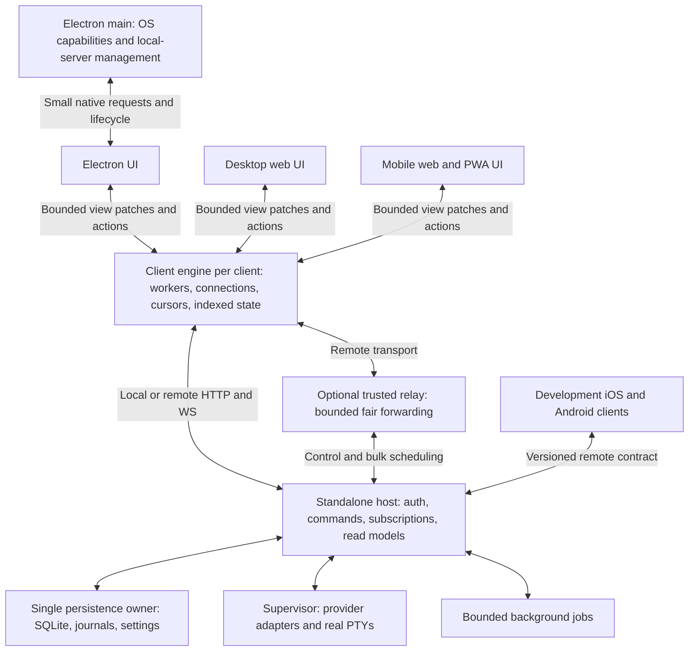

# V4 — finish the server-first foundation and qualify V2 for master

Date: 2026-09-13. Status: implementation in progress. Execution and evidence are
tracked in [V4_EXECUTION_LOG.md](V4_EXECUTION_LOG.md); no phase is complete until
its specified acceptance evidence is recorded.

Audited V2: `832fc5467f508a9b227978a0b5ae46b4ce6cbd9c`.
Fetched master: `9a4096ea8a448150402f2ccfa4f48ab5ca604efc`.
Both remote refs were fetched during the original read-only audit. Implementation
has since started; current commits, fixes, and unresolved gates are recorded in
the execution ledger. The audited hashes remain the before-state reference.

**Recommendation: do not merge this revision yet. Keep the architecture already
built, complete the ownership and client-isolation boundaries, repair the known
correctness gaps, and qualify the resulting production artifacts against master.**

V3 delivered substantial implementation. It did not establish the stronger claim
that a standalone host and every stable client remain responsive under concurrent
streaming, failure, upgrade, and weak-network conditions. Its own status still
leaves candidate qualification open. This plan carries completed work forward and
replaces the remaining execution agenda for the scope below; the older plans remain
dated evidence.

## 1. Product contract and scope

The stable foundation comprises the standalone server, Electron client, desktop
browser client, and mobile browser/installed PWA. Native iOS and Android remain in
master as development clients. Their shared-contract compatibility, compilation,
and relevant reducer/transport tests must remain valid; finishing their UX, native
store distribution, signing, push delivery, and platform-specific features is a
separate release program.

The intended ownership contract is:

- One server owns one data root, database, host settings, operation journal,
  schedules, credentials, and authoritative runtime state.
- The supervisor remains the sole owner of provider processes and real PTYs.
  Clients never create an alternative runtime or infer successful execution from
  an optimistic view.
- Electron can discover, start, and attach to a managed local server, or attach to
  a separately installed server. The same server can serve browsers and mobile
  clients simultaneously. Closing a client must not stop work owned by a
  standalone server.
- Electron main owns windows, native dialogs, keychain access, updater behavior,
  and other OS capabilities. Durable host business logic belongs in the server.
- Client UI threads own interaction and presentation. Incoming stream decoding,
  reconciliation, large persistence, and history processing have a bounded
  off-thread execution path.
- A slow, hidden, disconnected, or malicious paired client must not stall healthy
  clients or stop a provider process. Server-wide overload is handled explicitly,
  with bounded admission and recovery.

This is a multi-client personal host. The current scopes do not establish
independent multi-tenant/project isolation; that is outside this merge scope.

“120 fps” means smooth foreground interaction on supported 120 Hz hardware within
a declared workload. One frame is 8.33 ms, including JavaScript, React, style,
layout, and paint. Browsers can reduce refresh rates or suspend background pages;
network and provider latency cannot be made zero. The requirement is that stream
processing does not consume the UI frame budget and that measured delivery latency
stays within the limits below. It is not a guarantee on arbitrary hardware,
unbounded histories, background tabs, or power-saving modes. Browser animation
callbacks follow the display cadence and are normally suspended in hidden pages.
[MDN](https://developer.mozilla.org/en-US/docs/Web/API/Window/requestAnimationFrame)

## 2. What is already sound

| Foundation              | Current implementation                                                                                       | What to preserve                                                                                 |
| ----------------------- | ------------------------------------------------------------------------------------------------------------ | ------------------------------------------------------------------------------------------------ |
| Separate execution      | `BackendHostCore`, plain-Node headless entry, lazy supervisor startup                                        | Heavy runtime work already has a home outside Electron main; extend this composition.            |
| Shared durable services | `BackendDurableServices` provides schedules, PR watches, Git state, and app-control ingress                  | One implementation for desktop-managed and standalone hosting.                                   |
| Persistence             | SQLite WAL, explicit migrations, future-schema rejection, buffered runtime/terminal writes                   | Single-writer semantics and deliberate durability; do not replace storage without measured need. |
| Direct local transport  | `ElectronBackendTransport` and `BackendRendererStream`                                                       | Existing direct connection, replay, interests, and scoped recovery.                              |
| Remote transport        | Authenticated HTTP/WS, one-use WS tickets, scopes, revocation checks, ordered replay                         | Existing security boundaries and previous-client compatibility.                                  |
| Stream efficiency       | Interest filtering, reused serialization, gzip/ETags, bounded replay, image references, lazy status catalogs | Optimize from measured residual costs instead of restarting the protocol design.                 |
| Terminal recovery       | Cursor-sync v2, generation/cursor checks, chunked baselines, cumulative ACKs                                 | Exact terminal content and resumable bounded history.                                            |
| Renderer structure      | Keyed items, structural versions, frame-batched state commits, inactive-history limits                       | Narrow subscriptions, identity preservation, virtualization, and React Compiler conventions.     |
| V3 adoption             | Native queues, cursor-sync mirrors, background-task adoption, shared pairing fixtures, relay HTTP streaming  | These are completed implementations, not new work packages.                                      |
| Upgrade work            | WSL helper `2.17.0` and replacement regression                                                               | Qualify installed upgrades rather than repeat a constant bump.                                   |

The native ledger currently has 221 implemented entries per platform, zero planned
entries, and an intentional unsupported `push-config` entry. This describes wire
adoption; it does not turn the native clients into production-qualified products.

## 3. Findings that shape this plan

“Confirmed” below means the execution path was checked in current code. It does
not mean every failure was reproduced in a live application during this audit.
The checkpoint WebSocket failure is previously recorded live evidence; its cause
must still be established independently of the operation defects found here.

| ID  | Finding and evidence                                                                                                                                                                                                                                                                                                                                            | Required outcome                                                                                                       |
| --- | --------------------------------------------------------------------------------------------------------------------------------------------------------------------------------------------------------------------------------------------------------------------------------------------------------------------------------------------------------------- | ---------------------------------------------------------------------------------------------------------------------- |
| F1  | **Two host owners can open one data root.** Only the CLI calls `acquireDataDirLock` (`src/server/cli.ts:149`); Electron has its own app-instance lock and constructs a backend without respecting that host lock (`src/main/main.ts:156`, `:817`). Production defaults can share `.poracode`.                                                                   | One owner lock before migration, key setup, DB open, and services; attach to the existing owner or safely refuse.      |
| F2  | **Host settings still have multiple process writers.** Main-local handlers and backend remote settings paths read/modify/write the same file. Atomic rename prevents torn files, not lost updates (`src/main/ipc/localHandlers.ts:169`, `src/main/remote/DesktopRemoteAccessController.ts:461`, `src/main/sharedSettingsFile.ts:43`).                           | One backend settings owner; field-level commands and conflict semantics.                                               |
| F3  | **Standalone routing persistence still requires Electron.** The supervisor waits for routing-override confirmation, but only `src/main/main.ts:777` and `:785` persist/confirm the relevant events. The headless observer at `src/server/createHeadlessRemoteHost.ts:184` has no equivalent.                                                                    | Durable routing changes and selection preferences work without Electron.                                               |
| F4  | **Checkpoint revert remains a live blocker.** V3 records 3/3 idle-thread reverts failing when the direct renderer socket closes. No subsequent revert fix was found in the audited history (`docs/V3_ITERATION_PLAN.md:451`).                                                                                                                                   | Reproduce with correlated server/client logs, fix the real state/transport path, and requalify both Electron and web.  |
| F5  | **Checkpoint action identity is inconsistent.** The HTTP receipt caches a returned `outcome: failed` as completed, preventing the journal's retryable file phase (`httpRouter.ts:237`, `:1065`; `BackendHostCore.ts:495`). The desktop journal instead interprets a settled old key as a new action if later turns exist (`checkpointRevertOperations.ts:215`). | One immutable operation identity and state machine across transports; retry cannot delete another client's later work. |
| F6  | **Revert is serialized only against revert.** `revertLocks` does not reserve the thread against send/start/switch/delete; an intervening busy-provider error can still be followed by file restore and local truncation (`BackendHostCore.ts:340`, `:452`, `:485`, `:509`).                                                                                     | Coordinate incompatible mutations per thread and fence stale results.                                                  |
| F7  | **Local streams still cross Electron main.** The renderer registers interests on both paths, the backend always relays admitted IPC copies, main forwards them, and the renderer discards duplicates afterward (`electronBackendTransport.ts:77`, `:283`; `supervisorEventRelay.ts:39`; `main.ts:805`).                                                         | Per-window direct/fallback ownership; zero steady-state bulk content through main.                                     |
| F8  | **Electron remote HTTP still crosses main and buffers complete responses.** `mainProcessFetch.ts:34` uses `remoteHttpRequest`, base64-encodes binary uploads, and omits the caller's abort signal. Main handles and buffers it at `localHandlers.ts:229`.                                                                                                       | Off-main remote transport with real cancellation and bounded binary delivery.                                          |
| F9  | **Stream work still runs on the client UI thread.** JSON parsing, validation, reconciliation, and reductions run in `electronBackendTransport.ts:173` and `remoteServersStore.ts:892`. Full-thread membership sets are rebuilt per event (`:910`); browser persistence still serializes the app projection to localStorage (`dbStorage.ts:72`).                 | Shared off-thread client engine with indexed state and bounded view patches.                                           |
| F10 | **Congestion isolation is incomplete.** Any local renderer above the stream high-water mark sets global supervisor terminal shedding (`backend/index.ts:161`). In the relay host, reliable channel traffic can call the generic overflow path that closes the shared control socket (`relayHost.ts:246`, `:645`, `:660`).                                       | Isolate a slow client/channel at its own queue; preserve healthy streams and commands.                                 |
| F11 | **Shutdown does not fully drain/join work.** HTTP disposal resolves after five seconds even if active handlers remain (`RemoteAccessServer.ts:605`); supervisor stop does not await child exit, and its message callback lacks stale-child fencing (`SupervisorClient.ts:198`, `:241`).                                                                         | Explicit drain lifecycle, generation fencing, bounded escalation, and no writes after DB close.                        |
| F12 | **Final UI buffers and presentation costs remain.** Xterm hydration accumulates a string without a local cap and live writes have no app-level queue accounting (`XTermSurface.tsx:880`). Text smoothing adds a 240 ms drain target, while outer markdown normalization rescans revealed prefixes (`useSmoothStreamedText.ts:3`; `ItemMarkdownInner.ts:174`).   | Bound the final consumer queues and keep visible work within the frame budget.                                         |

Two additional risks require executable qualification. The PWA immediately
activates new workers and deletes old build caches while old documents can still
reference old hashed assets (`public/service-worker.js:49`). History paging still
includes all completed-turn metadata (`src/main/remote/server/snapshots.ts:269`).
These are concrete scaling/lifecycle mechanisms, but this audit did not reproduce
a deployment failure or measure a large-history regression.

**F13 — verified during execution: managed smoke builds are not isolated.**
`run-poracode-smoke.mjs:187` launches the checkout's `pnpm run dev`, whose tsdown
watcher writes `dist/main`; the live baseline's backend argv confirmed that path.
Another same-checkout build or session can replace binaries used by a later lazy
supervisor/backend restart. Phase 0 must stage immutable session-local runtime and
helper assets, record and validate their identities, and distinguish Vite HMR from
production qualification. Prove session A keeps its paths/hashes after checkout
rebuild and session B launch, including A's backend/supervisor restart; stopping B
must not remove A's assets. The initial sequential before/after reproduction is
valid only with the checkout artifacts frozen and their actual hashes recorded.

**F14 — verified during execution: local-only checkpoint reverts are silent.**
After the admission correction (`d7595e93d`), a real Qwen revert completed with
`provider_phase: failed` and `outcome: completed_local_only`. The renderer closed
the dialog, removed local history, and restored the prompt without explaining that
the provider conversation had not been restored. `MessageList.tsx` only used this
outcome for analytics. Before evidence is retained in
`/Users/svecherenko/.poracode-smoke/v4-after-revert-1789288800/artifacts/AFTER.md`.
Phase 2 must visibly disclose this partial outcome on the shared Electron/web
renderer, including when confirmation was disabled, without misreporting file or
provider restoration. Preserve the existing outcome/retry contract; localize the
warning and the existing failed/ambiguous messages. This focused feedback change
does not complete Phase 2's operation identity, concurrency, or crash guarantees.
Native disclosure remains development work and is not implied by shared-renderer
coverage.

Focused correction status: shared-renderer warning and both confirmation modes
are covered by rendered-UI tests; a fresh real Electron local-only revert visibly
disclosed the outcome and preserved the restored draft. Exact source/artifact
evidence is in
`/Users/svecherenko/.poracode-smoke/v4-feedback-after-1789291800/artifacts/FEEDBACK.md`.
This closes the focused feedback defect only, with the broader gates still open.

**F15 — verified by the outcome-feedback critic: skipped-confirmation errors are
invisible.** With "Don't ask again" enabled, `requestRevert` catches a failed or
ambiguous outcome only to log a warning. The user sees neither the normal dialog
error nor a notification. Two rendered-UI regressions reproduce the missing error
feedback (`tmp/v4-architecture-audit/f15-before-regression.log`). Phase 2's feedback
slice must show the existing localized/friendly error through the shared toast
pattern, preserve history and the draft, and make no automatic retry. This does
not change the checkpoint journal or decide how an ambiguous operation settles.

Focused correction status: the catch now shows the existing friendly error as a
danger toast. Failed and ambiguous responses are verified through actual rendered
toast regressions, including one request and unchanged local history/draft. This
is deterministic injected-response evidence, not a live provider failure test.

## 4. Correct the evidence before relying on it

**F16 — verified during master integration: first-output terminal refit can be
lost during hydration.** Master's launch-race retry was placed after V2's
hydration buffer early return. With an initially missing PTY, a pending empty
scrollback read, and one live prompt, the display receives the prompt but no
second resize reaches the PTY. The independent critic reproduced a resize count
of one in `XTermSurface.test.tsx`. Phase 0 must preserve the first-live-output
signal before buffering display bytes; historical replay must not consume it.
The focused correction and regression are in the integration branch. It requires
the normal terminal manual gate before final qualification.

**F17 — verified in the full test run: checkpoint fixtures inherit the runner's
Git identity.** Two fixture tests failed because inherited `GIT_AUTHOR_*` and
`GIT_COMMITTER_*` values override repository configuration and also prevent the
missing-identity case from running. This is a test-isolation defect, not a
checkpoint product regression. Phase 0 must clear and restore identity environment
variables inside the fixture suite, keep production Git identity behavior, and
rerun the real temporary-repository operations. The original full-run failures
and focused green result are retained under `tmp/v4-architecture-audit/`.

**F18 — verified by broad native verification: portable Swift harnesses retained
protocol 9.** Four independent Swift packages compile `HarnessShims.swift` when
the iOS App module is absent. Their mirrored protocol constants were still 9,
so generated protocol 12 metadata rejected valid route requests and responses.
The normal AppTests build binds production constants and cannot expose this
drift. PortForwarding's real contract tests failed 3/5 cases before updating the
four mirrors; the full PortForwarding, BrowserMirror, GitHubOperations, and
AdvancedOperations suites then passed 173/173. Phase 0's compatibility audit and
future native qualification must include these portable consumers. Evidence is
retained under the integration worktree's `tmp/v4-native-broad/`.

**F19 — verified during the settings-watcher investigation: cache reads can
precede observation.** If the settings file is absent on the first read, defaults
remain cached after the file appears and the watcher finally attaches. An atomic
replacement between the first cache fill and watch registration creates the same
stale-cache state. Three regressions cover creation, that registration interleaving,
and failed-watch recovery. The fix registers observation before reading and
invalidates old cache data on successful attachment. A healthy watcher still makes
hot reads return without filesystem I/O. The separate full-suite first-replacement
failure that led to this investigation has an unproven cause; preserve that limit
instead of treating a retry as diagnosis. Phase 1's authoritative settings service
must preserve these guarantees.

**F20 — corrected execution tooling error: shared dependency links are not
worktree isolation.** A temporary whole-directory `node_modules` symlink in the
CI worktree let pnpm 12 reconcile dependencies using that worktree's path depth
and rewrite the root checkout's package links. The symlink was removed after
verification, then a root frozen-lockfile install with scripts disabled repaired
the links. Electron/TypeScript/Vitest resolution, the Electron binary, SQLite,
and PTY module loading were verified; package and lock files were unchanged.
Never share `node_modules` across worktrees by symlink or run pnpm through such
a link. Use independent installs or invoke installed tooling directly. This was
a tooling error during execution, not a product regression. The before/after
record is `.tmp/v4-ci-gates/tmp/v4-ci-gates/F20-dependency-links.json`.

**F21 — verified observer stalls: synchronous resource probes.** Both memory and
host-load samplers execute `spawnSync("ps")` on the test client's event loop.
A controlled delayed-probe fixture reproduced heartbeat gaps over 200 ms while
sampling. The correction uses bounded asynchronous subprocesses, serial probes,
and an awaited stop before final summaries. Memory report version 3 and host-load
version 2 identify the changed observer. Preserve the raw before/after evidence;
this verifies observer behavior, not app latency or an idle measurement host.
Process CPU, queue, event-loop, compositor, and input instrumentation remain
required by Phase 0.

**F22 — verified settings outcome error: notification failure after persistence.**
The settings ownership review found that a notification callback throwing after
an atomic write could produce a failed-save acknowledgement. A throwing error
reporter could also suppress routing acknowledgement entirely. Keep persistence
outcomes separate from best-effort notification/reporting, and test both cases
before completing the first Phase 1 settings slice. The full authority work must
also remove the supervisor ACP-registry and CLI-hook-support file writers; the
latter performs a non-atomic whole-file write. These supplement F2's original
main/backend and stale-renderer snapshot findings.

**F23 — verified frozen-runner coverage defect: voice source import.** The full
smoke at clean combined `7c0daf676` fails its mock voice gate because it imports
`/src/renderer/speech/liveVoice.ts`, a Vite development URL absent from the frozen
bundle. Route the deterministic test through a bundled development test bridge
and rerun against a fresh snapshot. This result does not demonstrate a product
voice failure. Do not restore shared checkout/HMR access to hide the defect.

**F24 — verified missing Quick Composer mock coverage.** The same full run
explicitly fails Quick Composer because the inventory has no deterministic mock
check. Add safe fixture coverage through the real isolated window and keep the
external/global-shortcut manual gate honest. Do not acknowledge unexercised
controls or mark the full smoke passed while this gate is absent.

**F25 — verified lease-helper regression, caught before startup wiring.** The
first kernel-lease helper opened and closed the existing lease file outside
SQLite during a repeated acquisition attempt. On POSIX that unmanaged descriptor
close released the same process's existing `fcntl` lock; a real second process
then acquired ownership while the first lease still appeared active. Exclusive
file creation (`wx`) now touches only a new file before acquisition. Existing
lease files must never be opened/read/copied outside SQLite while owned. Repeated
same-process refusal followed by an actual external contender is a required
regression. Import snapshot code must respect the same SQLite descriptor rule.

**F26 — verified Quick Composer reopen state.** The actual native window
successfully hides and shows, but its renderer can remain in `closing` when the
OS does not grant focus and Chromium emits no hidden visibility transition.
The current reset depends on both signals. Drive reopening from the native show
transition, preserve focus-only returns from dialogs, and test the no-focus case
before repeating the real frozen window journey. Keep ordinary shortcut/drag/
motion/provider verification distinct from this reproduced scenario.

**F27 — verified Quick Composer empty-project render loop.** The real overlay's
Zustand selector returns a fresh empty array when no project is selected. React's
external-store snapshot check repeatedly renders before the Add project action
can run. Use the existing stable empty-value convention and keep a no-project
render/action regression alongside the pending-submission tests. This was caught
while testing F26; final native coverage remains required.

**F28 — verified subframe navigation stalls native handoff.** Electron's broad
`did-start-loading` listener clears the main renderer's readiness and event
interests even for an embedded frame. In a frozen app, a control submission
arrived, but a submission after adding a local `srcdoc` iframe remained queued
until an explicit diagnostic ready acknowledgment. Reset readiness only for a
current main-frame document replacement or current renderer loss. Test ordinary
subframes, same-document navigation and retired-window events, then repeat the
actual handoff without injecting a ready acknowledgment into the passing path.

**F29 — verified draft instrumentation misses a post-reset stall.** The first
in-process sampler reported about 1.3 ms maximum delay around an actual 100 ms
blocking loop. Node's timer histogram reset also clears its previous timestamp,
so the first subsequent callback does not record a delta. Keep the callback
timestamp independently from the resettable histogram, record unfinished
intervals explicitly, and repeat the owned-process CPU/stall/GC check. The
instrumentation stays opt-in and must have bounded output and measured overhead;
none of these diagnostic checks qualifies an application performance budget.

**F30 — verified durable-service work survives disposal.** With a PR check held
inside `getPrForBranch`, disposing the service still allowed two later store
reads, one delete and a mocked merge invocation. Schedule configuration awaits
and MCP ingress dispatch have analogous unjoined ownership paths in the traced
code. Close their admission, cancel work before further side effects, and join
admitted continuations before settings authority, SQLite and the host lease are
released. Retain the synthetic PR regression; no real automation action is needed
to prove this boundary. This extends F11's remaining service-drain work.

**F31 — verified usage-cookie continuation races.** A delayed Chromium cookie
read can restore a stored login after Clear, and the native mirror's Stop can
return before that read finishes and writes again. The usage-secret adapter must
check current consent and equality atomically at the backend and join/cancel
native mirror continuations during stop. Keep delayed-read/clear/stop regressions
and ensure session-only credentials and retired owners cannot persist new secrets.

**F32 — verified live-owner lease loss through garbage collection.** A child
acquired the kernel lease, dropped its last JavaScript reference, and remained
alive. Forced garbage collection closed its SQLite connection, allowing a second
child to acquire the same root. Retain successfully acquired leases until explicit
release or process exit; an abandoned startup/shutdown failure must not imply a
confirmed join. The regression now proves exclusion through GC and successful
acquisition only after the actual holder exits. A separate first-open liveness
race produced two refusals in five of thirty simultaneous startup pairs, never
two owners. Acquire `BEGIN EXCLUSIVE` before enabling retained locking, so schema
reads cannot retain shared locks while both contenders attempt an upgrade. Thirty
pairs then each admitted exactly one owner. SQLite documents retained shared-read
locks in [locking-mode behavior](https://www.sqlite.org/pragma.html#pragma_locking_mode).
These helper checks do not qualify runtime bootstrap, ingress drain, desktop
attachment, or Linux/Windows ownership behavior.

**F33 — draft local-control peer impersonation, caught before activation.** A
real replacement loopback listener with no private discovery credential echoed
public request/generation IDs and supplied an unrelated pairing URL; the draft
bearer client accepted it. The replacement receives any transmitted bearer, so
signing with that same disclosed value would not prove the peer. The candidate
now keeps the discovery secret off the socket and domain-separates HMAC request
and response proofs over exact bounded bytes, version, route/Host, fresh nonce,
generation and response status. It authenticates replies before parsing them.
Wrong-key, reflected/stale proof, modified body/status, retired generation and
stale-port tests cover the boundary. Threat scope is another OS user without
private-record access, not same-privilege compromise. This is local control 1,
separate from remote OAuth and the still-unimplemented desktop attach operation.

**F35 — draft control-discovery cleanup could hang completed shutdown.** After
a real temporary control listener and request completed, making its directory
read-only caused discovery unlink to throw EACCES. The draft disposal promise
remained pending and emitted an unhandled rejection. Cleanup now runs only after
actual connection/listener/work joins and reports a fixed error without a private
path or credential; a failed unlink alone does not strand the lease. The closed
port refuses calls, and stopped/successor generations reject its stale record.
A failed or unconfirmed listener/work join still prevents database/owner release.
The real-child before/after probe and realfs stale-generation regression remain
separate from packaged shutdown qualification.

**F36 — concurrent control pairing revoked a successful earlier result.** Two
real owner-control calls returned different URLs, but the second call reused the
desktop QR rotation method and revoked the first credential. Its OAuth exchange
then returned 401; a retained receipt could only replay the revoked URL. Owner
control now issues independent one-time credentials through the existing auth
store. The real regression requests both URLs, replays the first receipt and
exchanges both successfully, while consumed-token replay is still refused.
Displayed desktop QR rotation retains its existing behavior and coverage. No
remote wire or persisted auth format changes are needed for this internal method.

**F37 — an admitted push outlived headless ownership.** The real factory/lease
probe held a synthetic Android delivery, completed host disposal, acquired a
successor and wrote its registration. The predecessor's late 410 then overwrote
that file. The shared coordinator now closes event/send/timer admission
synchronously and joins all admitted continuations, including parallel sends
after a sibling rejects. Headless composition awaits that barrier before SQLite
and owner release. Electron must join the same API across disable, retry and
reconfiguration; that sibling integration is a separate reviewed slice. A
transport deadline cannot substitute for the actual continuation join.

**F39 — a late rejection removed a refreshed push credential.** Updating a token
while its old request was pending did not protect the replacement from the old
410 response. Pruning now compares the exact sent token or web subscription and
its device/platform/host/client identity. Eleven real coordinator/store cases
cover native token kinds, web endpoint/keys and routing replacement; unchanged
credential pruning remains covered. The internal compare-and-remove API changes,
but the persisted format and remote payload remain compatible.

**F40 — startup had no signal owner.** SIGINT/SIGTERM were registered only after
factory and listener startup. Real owned Node children exited during held startup
before cancellation or cleanup could run. The CLI now registers before calling
the factory, forwards startup cancellation without releasing the owner, starts
available runtime disposal immediately and joins actual construction/start/cleanup
before exit. SIGINT and SIGTERM tests retain a real lease until the final held
drain is released; an unconfirmed drain retains the child and its lease. The child
uses synthetic application services, so these cases qualify CLI signal ordering,
not provider descendants or an installed application's complete shutdown.

**Headless ownership activation status.** The standalone candidate now composes
through the shared owner controller and versioned sibling root before key/DB
initialization. Its explicit pair command uses the common authenticated control
service. Startup cancellation retains ownership through runtime drain; CLI startup
and shutdown reporters do not force exit after unconfirmed cleanup. Synthetic
real-host fixture preparation now follows the same root mapping and credential
provenance, preserving the existing seeded workload rather than silently testing
an empty database. Desktop startup/attach, all settings/usage writers, legacy
activation/recovery, combined SSH preflight/cache fencing and cross-platform
installed lifecycle remain open Phase 1 work. See [Host ownership](HOST_OWNERSHIP.md).

**F11 ingress follow-up — actual continuations must outlive their transport.**
Real loopback requests with disposable SQLite reproduce early database closure
both after the old five-second HTTP deadline and within 100 ms of a client abort.
Concurrent starts also minted different pairing credentials, and a retry could
bind after disposal returned. The isolated request-drain slice now closes
admission synchronously, joins a single listener start/stop, and tracks HTTP,
WebSocket and forwarded stream continuations through settlement. The same shared
work/socket barriers repair MCP's orphaned concurrent listeners and late tool
continuations; AppControls awaits that ingress join. A connection deadline ends
transports only. It cannot authorize database closure or lease release while an
admitted handler remains. Private backend request draining, native facade/main
joins, parent deadlines, provider descendants and Windows shutdown remain open
F11 work; these ingress results do not qualify the full shutdown gate.

**F34 — verified Browser smoke visibility false-positive.** On frozen `d31c836bc`,
the full mock suite reported Browser success while its navigation screenshot
still showed GitHub Actions. The prior scenario left that fullscreen overlay
open; synthetic DOM clicks operated the Browser behind it, and toolbar existence
checks accepted an occluded input. A real pointer assertion reproduced the failure
(`browser-visible-before.log`), with both panel states and the occluding header
recorded separately. Return through the visible overlay control, use guarded
pointer input, require the Browser settings step and screenshots, and repeat the
visible flow. The old Browser PASS is not accepted as visible-surface evidence;
no production Browser rendering defect is established by this harness failure.

**F11 backend continuation follow-up.** The private backend entrypoint also
released its database before admitted IPC/direct-renderer callbacks or initial
stream binding settled. Real loopback stream disposal could finish before its
handler, and partial upgrade sockets were outside the close barrier. The bounded
follow-up registers normal requests and initialization separately, closes
admission, joins startup before collecting handles, then initiates producer
cancellation while joining normal callbacks. Reverse-native replies stay live;
their promises drain after producer cleanup. Failed joins retain the database.
The parent reply path remains available for the retiring child and fences late
native completions from replacement children; its prior disposed guard would
have stalled the new drain despite correct backend admission.
The direct renderer listener uses the shared socket/work barriers. These changes
require the owner's early cancellation hook at activation, and do not complete
parent deadlines, native facade execution, process-tree or Windows qualification.

**F42 — verified push gateway response lifetime and byte-limit gaps.** Three
real disposable loopback HTTP regressions reproduce a config response body
remaining pending beyond the configured timeout, acceptance of an oversized
config body, and an unused delivery response left open after status acceptance.
The timeout covered only response headers. Keep its deadline through bounded
config consumption, release unused response bodies, and verify cache recovery
after failure. These are host HTTP-client lifetimes; they do not imply that a
client timeout reverses an already accepted push delivery. The F37/F39 coordinator
and exact-token corrections remain separately required.

**F37/F39 — verified push work and retiring server generations.** A held gateway
response could outlive its coordinator and later rewrite registrations; an old
unregistered-token response could also delete a newer token for the same device.
The shared coordinator now closes admission and joins actual sends and their
continuations, while token removal compares the exact registration and token
that were sent. Desktop composition must retain disabled and replaced HTTP/push
generations through final shutdown, including a previously settled failed join,
and wait for retirement before opening a replacement. A shared lazy registration
store avoids separate caches across those generations. Root's controller tests
prove these joins with an actual coordinator and disposable registration files;
they use a synthetic HTTP server and gateway. Headless composition, real-app
integration and the full F11 process shutdown gate remain separate requirements.

The existing suites are valuable, but their names and comments sometimes claim
more than their execution establishes:

- The shared-host load test uses Node WebSocket consumers as its “GUI clients.”
  Its eight agents are PTY generators. Steer/Stop there mean terminal input/close;
  the bounds allow seconds and contain no React, input, layout, or paint
  measurement (`tests/native-e2e/sharedHostLoadProfile.test.ts:54`). Keep it as a
  transport/correctness test and add actual rendering clients.
- `remoteProtocol.perf.test.ts` allows about 6,006 ms to parse/reduce about 6,006
  frames. A pass is not evidence of an 8.33 ms frame budget.
- The latest payload seed has 60 threads and at most 40 items per long history.
  Text is generated from eight words. Its strong compression ratio and one-page
  result cannot justify conclusions about 400/4,000-item histories, large
  completed-turn collections, or realistic tool output.
- The constrained suite points a TCP shaper directly at `host.hostPort`
  (`constrainedNetwork.test.ts:473`). It does not instantiate the production
  relay. Correct the contrary claim in `docs/RELAY_HTTP_STREAMING.md` and add a
  real two-hop relay test.
- The original `processMemorySampler.ts` overwrote the root RSS sample, so the
  reported own-process “peak” was the last sample. Memory report version 2 fixed
  that accounting; version 3 additionally removes the synchronous observer stall
  described in F21. Total RSS includes descendants. Machine load is not process
  CPU. Older unversioned own-process peaks are invalid evidence and must be
  remeasured; contaminated benchmark runs remain disqualified.
- Existing performance budgets are largely recorded in documentation rather
  than asserted. Raw traces and build identity must become durable CI artifacts;
  an ignored `tmp/` directory or an old dirty build is insufficient release proof.

At the original audit, master had two commits absent from V2:
OpenCode 2 (`1936a1914`) and the single-pane accessibility fix (`9a4096ea8`). The
first introduces replacement-delta semantics, procedures, and packaged dependencies.
That V2 revision used remote protocol 11, SSH manifest 1, supervisor status cache 34, and
renderer status cache 31. Taking the larger version constant from either parent
does not invalidate every incompatible parent artifact. Audit both histories and
choose fresh compatibility generations where needed.

A merge-tree preview found **32 textual conflicts**, including runtime items,
terminal/thread UI, contracts, locales, dependencies, and status caches. No branch
was merged or switched during that read-only audit. PR #725 then reported draft/conflicting and no current-head
checks; the latest observed branch runs are at `bf147750c6` from September 12,
not the audited head. Recheck live state during execution.
[PR #725](https://github.com/Porabuild/Poracode/pull/725),
[recorded native run](https://github.com/Porabuild/Poracode/actions/runs/34680979275).

## 5. Target architecture



The shared client-engine box denotes shared implementation, not one worker shared
by unrelated devices. Start with one worker per renderer/browser client and
multiple host sessions inside it. Do not create a worker per thread or connection.

Keep TypeScript, Node, SQLite, HTTP, and WebSocket as the initial implementation.
Do not make a Rust rewrite, microservice split, database replacement, or universal
binary-codec migration a prerequisite. The dominant verified gaps are ownership,
duplicate delivery, scheduling, and unbounded work. Electron's own guidance calls
for protecting both main and renderer threads and using workers for substantial
CPU work. [Electron performance guidance](https://www.electronjs.org/docs/latest/tutorial/performance)

The server's socket/control loop must have bounded work. Keep asynchronous I/O on
Node's normal I/O path. If profiling shows synchronous DB/read-model work exceeds
the control-loop budget, move that responsibility into one bounded persistence
worker, with one command owner and an ordered change feed. Do not spawn a DB worker
per request or keep a second writable database authority. Node workers are useful
for CPU-bound JavaScript; ordinary asynchronous I/O does not benefit from simply
moving it into more workers.
[Node worker guidance](https://nodejs.org/api/worker_threads.html)

## 6. Execution sequence

### Phase 0 — reconcile master, freeze scope, and establish trustworthy baselines

Owner: integration maintainer and performance owner. Dependencies: none.

1. Integrate the two current-master commits in an isolated integration branch;
   resolve all conflicts semantically. Preserve V2 ownership/recovery work and
   master provider/accessibility behavior.
2. Audit runtime events, generated bindings, SQLite migrations, cache versions,
   SSH manifest/assets, worker/local IPC versions, and helper versions against
   both parents. Add pre-upgrade fixtures before choosing version bumps. Implement
   authoritative replacement-delta semantics in every consuming reducer, including
   native development clients.
3. Regenerate contract inventory, codecs, operation maps, and parity evidence.
   Update current architecture docs: `.agents/docs/architecture.md` still describes
   the old Electron-main DB model, and `REMOTE_ARCHITECTURE.md` contains conflicting
   protocol/inventory statements.
4. Repair the resource sampler; add correlated command/event IDs, queue byte/age
   counters, event-loop delay, process CPU, and client frame/input instrumentation.
   Keep diagnostics bounded and free of message content, tokens, file contents,
   and credentials. Local/CI diagnostics are sufficient; new product telemetry is
   not required.
   The implementation now covers process CPU/event-loop/GC and opt-in application
   IPC waiting-queue estimates/ages, with explicit missing/error observations and
   per-sender generation identities. Native IPC bytes, terminal coalescer bytes
   and ages, other client/relay queues, command/event correlation and frame/input
   traces still need coverage. A complete diagnostic file alone does not qualify
   any latency, memory or rendering gate.
   Diagnostic budget/error stops must also end per-message capture work; this
   requirement was reproduced and fixed during the queue collector review.
5. Build exact master and integration revisions on the same toolchain/hardware.
   Use SQLite online backups or controlled synthetic fixtures. Copied state must
   point only at disposable cloned projects, have real automation disabled, and
   have credentials scrubbed before startup; a new base directory alone does not
   make schedules or old project paths safe. Record cold and warm runs separately.
   Never let one binary migrate the other's benchmark data. Reserve the host for
   measurements: separate worktrees do not isolate CPU, disk, memory, or thermals,
   so builds/tests and unrelated simulators must not overlap measured runs.
6. Inventory required CI checks and restore current-head execution. Review
   `deploy-nightly-pwa.yml`: master pushes currently publish the nightly PWA
   independently of CI. Gate deployment on a qualified artifact or stage the
   candidate so merging cannot silently expose an incompatible public client.

Exit: a clean integration baseline, known compatibility identities, working
measurement pipeline, comparable master results, and a controlled deployment path.
This baseline will move as fixes land; the final freeze occurs in Phase 8.

### Phase 1 — make the server the exclusive durable owner

Owner: server maintainer. Depends on Phase 0 compatibility decisions.

1. Move the data-root lock into common host bootstrap and acquire it before any
   migration, key initialization, DB open, schedule, or supervisor startup. Include
   owner identity/generation and stale-owner handling that cannot steal a live
   lock during concurrent launches.
   Existing older Electron versions do not honor this lock. Detect/refuse a live
   legacy owner using verified process identity, or import into a distinct root;
   never assume the candidate lock alone excludes an already-running old app.
2. Add discover/attach/start behavior for Electron. A second client attaches to the
   same healthy owner. An incompatible owner produces a clear upgrade/restart
   result; it never opens the same root as another authority.
3. Define managed-local versus externally managed lifecycle. Under the intended
   standalone mode, closing all clients leaves accepted work and schedules alive;
   stopping the server is an explicit server-management operation.
4. Centralize host settings, profile mutations, routing overrides, and selection
   persistence in backend services. Use scoped patches and revisions instead of
   stale full-settings replacement. Keep device-only appearance/navigation/drafts
   in client storage and native secret primitives behind small OS capabilities.
5. Move the Electron-only routing handlers into the common durable observer.
   Audit remaining main event handlers for other durable effects that must run
   without a window.
6. Design and test credential ownership during desktop-to-standalone migration:
   existing `secret-key.safe` and `secret-key.headless` formats must not silently
   become interchangeable. Preserve access to existing provider credentials and
   pairings using an explicit migration or controlled import.
   Resolve unattended key access before completing managed-local detach/restart:
   prove server restart with no Electron client available, not merely continued
   operation with a previously unsealed key still in memory.
7. Publish a supported standalone installation artifact/runbook by reusing the
   current headless/SSH packaging foundation. Specify supported OS/architectures,
   Node/native ABI, assets, data paths, service startup, health/readiness,
   diagnostics, backup, upgrade, and recovery. Prove installation outside the
   checkout without Electron or dev dependencies.

Acceptance: concurrent desktop/server launches in both orders; separate roots;
stale-lock recovery; old/master Electron already using the root in either startup
order; attach/detach/restart; schedules and providers continuing with
zero clients; headless routing set/list/remove plus restart; concurrent settings
edits preserving independent changes; existing credentials remaining usable.

### Phase 2 — repair operation correctness and crash lifecycle

Owner: runtime/persistence maintainer. Depends on the single-owner contract.

1. Reproduce the reported checkpoint disconnect on a production Electron build.
   Correlate request ID, socket close code/reason, server exception, process exit,
   and journal phases. Do not treat a dialog change or a longer timeout as the fix.
2. Give each deliberate checkpoint action a fresh operation ID. Persist/reuse that
   ID only for retries of the same action. A settled ID always refers to the same
   frozen target and result, even after another client appends work.
3. Use the checkpoint journal as the authoritative operation state. Remove or
   adapt the generic HTTP receipt layer so retryable failure phases can resume.
   Add status reconciliation for requests whose response was lost. Bind command
   identity to the authenticated authority, target, payload fingerprint, and
   relevant revisions; reject mismatched reuse.
   Migrate historical receipt/key-family semantics deliberately; an upgrade must
   not reinterpret an old completed action as a newly authorized mutation.
4. Coordinate incompatible mutations per thread: send/start, queued input,
   provider switch, delete, revert, and transcript replacement. Reserve the
   operation across async phases and fence stale completions with session/thread
   generations. Coordinate Git/file operations by affected worktree where needed.
   Unrelated threads continue concurrently; Stop/cancellation must not queue behind
   a long bulk operation on a global mutex.
5. Preserve explicit states for running, retryable failure, completed, and
   ambiguous external side effects. Never automatically repeat a provider action
   merely because a transport request timed out. Do not add an offline-send outbox
   as part of this work. Disclose `completed_local_only` to the user rather than
   presenting it as a complete provider rewind (F14), including after opting out
   of the confirmation dialog. Failed and ambiguous outcomes must also remain
   visible when confirmation is disabled (F15); never retry them automatically.
6. Implement shutdown phases: stop admission and background producers; settle or
   drain tracked requests; stop supervisor with bounded join/escalation; process
   final valid events; flush persistence; close DB; release ownership. A deadline
   must not mean an untracked handler can continue into a closed database.
   Join the handler continuation after a client disconnect, and join pending
   listen/start attempts before closing their sockets. Existing keep-alive,
   upgraded and MCP batch inputs must not admit new operations once stop starts.
7. Fence supervisor messages and replies by child generation, matching the more
   complete fencing already present in `BackendHostClient`.
8. State durability precisely. A command acknowledged as durably accepted needs a
   durable receipt before acknowledgement. Completed canonical history and recent
   terminal output can have different loss budgets; quantify existing buffering
   and WAL behavior under process crash versus machine/power failure.

Acceptance: provider succeeds/file restore fails once/retry succeeds without a
second provider action; response loss followed by another client's new turn and
old-ID retry; deliberate new-ID revert; held-phase races against send/switch/delete;
backend/supervisor kill at operation boundaries; long HTTP request during shutdown;
late old-child events; repeated signals; no orphan processes or post-close writes.
Repeat checkpoint journeys through both local direct and HTTP transports and
include a successful subsequent provider turn.

### Phase 3 — keep bulk traffic out of Electron main

Owner: Electron/client transport maintainer. Can overlap Phase 2 after Phase 1's
ownership contract is fixed.

1. Bind each direct connection to an authenticated renderer identity and transport
   generation. Negotiate delivery ownership per window, with an acknowledged
   handoff boundary and cursor.
2. Main receives only shell-relevant state, native capability messages, and
   explicitly owned fallback traffic. Do not suppress IPC globally because some
   other window received an event; existing tests correctly guard that failure.
3. Recover a failed direct connection by sequence replay or scoped snapshot. Keep
   fallback bounded and observable; it must not silently become permanent bulk
   routing through main.
4. Move Electron remote HTTP into the off-main client transport. If Electron
   origin/CORS constraints require a utility process, use one narrow network
   bridge. Preserve endpoint restrictions, credentials, redirect policy, and
   origin checks; do not broadly disable web security.
5. Propagate cancellation and request identity. Stream binary chunks with bounded
   queues/transferable buffers instead of base64/full-body IPC copies.
6. Budget replies as well as events. `BackendRendererStream.sendReply` currently
   bypasses the event sender's buffered-budget path and accepts large responses.
   Bound pending requests, response size, bytes in flight, and cancellation.

Acceptance: two or more windows with one direct socket down, eight producers,
large history/attachment traffic, continuous typing/resizing/native-menu use.
Steady-state main bulk bytes equal zero after handoff; main remains responsive;
fallback window converges without duplicate effects; cancelled work releases its
network resources promptly.

### Phase 4 — build the shared off-thread client engine

Owner: renderer/transport maintainer. Depends on the transport ownership contract;
can be developed against recorded protocol fixtures before Phase 3 is finished.

1. Extract transport decoding, boundary validation, sequence/generation handling,
   replay reconciliation, normalized entity indexes, history paging, and large
   IndexedDB operations into shared client-engine modules hosted in a worker.
2. Validate wire values once, then use trusted typed internal events. Maintain
   thread membership indexes incrementally instead of rebuilding all-host sets
   for each frame. Reuse the current canonical reducers and fixture semantics.
3. Unify local/remote batch scheduling with explicit side-effect hooks. Keep
   non-repeatable actions outside coalesced view projections. Never reorder
   requests, approvals, turn boundaries, or destructive events.
4. The UI subscribes to entities and visible ranges. Send bounded changed-row/item
   patches; never `postMessage` whole growing transcripts or full store snapshots
   per token. Version the worker protocol and fence worker restart/host reconnect
   generations. Bound both worker input and worker-to-UI output.
5. Use a frame-aware UI drain with a byte/time budget and one scheduled drain per
   view. Rendering may coalesce text changes; canonical state retains all ordered
   events. ACK/credit semantics must describe applied/retained state, not merely
   that the network socket read bytes. Keep overload/resync explicit.
6. Move large browser persistence out of synchronous localStorage. Keep only a
   small boot/view record there. Preserve durable composer drafts and migrate or
   invalidate old IndexedDB/localStorage shapes deliberately.
7. Keep structural-version caches and virtualization. Make long markdown work
   incremental at block boundaries; avoid repeated full-prefix scans. Bound or
   bypass cosmetic text smoothing when it adds excessive backlog or visible lag.
8. Bound terminal hydration/live queues and track xterm parse completion. Use
   limited delivery quanta; if a view cannot keep up, rebuild from authoritative
   scrollback with generation checks. Preserve replay-query suppression and exact
   terminal modes. Do not pause the provider PTY to solve a view's backlog.
9. Suspend expensive hidden-view presentation. Keep the minimum state needed for
   notifications/recovery, reduce interests, and refresh immediately on return.
   Do not depend on background animation callbacks to preserve correctness.
10. Keep shell readiness separate from history, provider discovery, Git scans,
    and connection readiness. Render cached/navigation state promptly, label
    freshness, and enable mutations only when their authority is ready. Background
    hydration must not block typing, scrolling, or switching views.

Acceptance: traces place decode/reduction/persistence on the worker; patch copying
and UI application fit their budgets. One changed item/row has similar cost on
100-, 1,000-, and 10,000-thread diagnostic fixtures. Test a huge single assistant
message, not only many short rows. Delay terminal hydration while producing output;
freeze/resume one view; prove bounded memory and exact restored content.

The browser WebSocket API itself does not provide receive-side backpressure.
Moving its handler to a worker protects interaction but does not bound memory;
application queue limits and flow control are still required.
[MDN WebSocket](https://developer.mozilla.org/en-US/docs/Web/API/WebSocket)

### Phase 5 — enforce server and relay fairness

Owner: server/protocol maintainer. Depends on Phase 2 operation semantics; can
overlap Phase 4.

1. Specify every queue: owner, byte/count limit, oldest-item age, maximum concurrent
   work, overflow action, cancellation, and recovery source. Cover ingress RPCs,
   DB/jobs, supervisor IPC, direct renderer replies, WS events, replay, terminal
   baselines, relay HTTP, and forwarded binary channels.
2. Enforce per-client and global admission on expensive work. Limit concurrent
   histories, Git work, image processing, and large transfers; use deadlines and
   explicit busy responses. Coalesce identical reads and invalidate cached read
   models by authoritative revisions.
3. Separate command/approval/Stop handling from bulk history and presentation
   traffic in the application scheduler. Preserve event order within each stream;
   prioritization must not let a turn-completed view overtake its required data.
4. Remove one renderer's congestion as a reason for global source shedding.
   Retain supervisor shedding for actual shared IPC overload, with recoverable
   loss signals. A slow renderer should lose its own subscription budget and
   recover independently.
5. Implement fair per-channel outbound scheduling in both relay directions,
   including host-to-relay reliable messages. Evict/cancel the responsible channel
   or request instead of closing the common control socket on its overflow.
   Reserve a bounded control budget; do not make forced control writes unbounded.
6. Treat HTTP-stream pacing and WS forwarding as one resource model. Exercise
   cancellation, idle deadlines, headers already sent, malformed frames, and a
   healthy sibling during overload. Preserve the current buffered fallback for
   older negotiated relay peers.
7. Profile synchronous persistence/serialization and compression concurrency under
   realistic load. If the host loop misses its budget, move the expensive
   responsibility into the bounded worker described above. Preserve immediate
   ordering/durability requirements instead of asynchronously publishing before
   required writes complete.

Acceptance: eight producers, four real active clients, one stalled client, and
32 authenticated connections in the capacity run. Healthy peers maintain latency
and no-gap guarantees; memory settles after drain; stalled channels cannot kill
the control socket or providers. Repeat with congestion on each relay hop and on
a shared bottleneck. Include large concurrent RPC replies, not just event floods.

### Phase 6 — make payload cost proportional to visible work

Owner: protocol/read-model maintainer. Depends on corrected measurement and
compatible client engine; optimize from the expanded baseline.

1. Keep HTTP for discovery, commands, paged history, files, and uploads; keep WS
   for ordered events/terminal traffic. Keep JSON for small structured controls
   initially. Compare wire bytes, decode CPU, allocation, and complexity before
   selecting an additional codec.
2. Expand fixtures to realistic mixed text, code, tools, diffs, image references,
   and low-compressibility content. Measure shell snapshots at 60/1,000 threads
   and histories at 40/400/4,000 items, with large completed-turn collections.
3. Bound initial history by bytes as well as item count. Page completed-turn
   metadata consistently with the transcript and lazy-load large tool bodies.
   Provide small shell rows and revisioned deltas where measurements show full
   refresh cost grows with the entire host. ETags save transfer, but rebuilding,
   validating, serializing, and hashing the whole snapshot still costs server CPU.
4. Preserve sequence semantics when filtering subscriptions. The current remote
   global sequence intentionally sends empty envelopes for unobserved bulk events.
   Do not simply drop those frames. If that overhead breaks budgets, negotiate
   per-subscription cursors or explicit sequence-range advancement and test replay
   and mixed-client behavior.
5. Keep terminal/binary content out of base64 JSON on hot paths where measured
   savings justify a negotiated frame extension. Avoid double-encoding relay
   payloads. Preserve exact byte fidelity, message boundaries, native decoding,
   length limits, and old-peer fallback.
6. Limit scheduling quanta by both time and bytes. At 32 kbps, even 1 KiB consumes
   about 256 ms of serialization time before overhead; a large queued frame can
   delay a tiny Stop command. Priority cannot preempt bytes already written to a
   TCP socket. Use small adaptive chunks and bounded queued bytes; use a separate
   control lane only if measurements show one ordered connection cannot meet the
   latency contract.
7. Retain asynchronous HTTP compression and tune WS compression with real Linux
   concurrency/memory measurements. Compressing small controls or already
   compressed binary data can waste work; `ws` explicitly warns that compression
   adds CPU/memory costs under concurrency.
   [ws compression documentation](https://github.com/websockets/ws#websocket-compression)

Acceptance: paged-tail bytes remain bounded as total history grows; unrelated
thread output contributes only the agreed small state/control traffic; no
reconnect amplification; weak-link control latency remains bounded during history
and file transfer. Any codec change must improve measured total cost and preserve
the complete compatibility matrix. A codec rewrite is not itself an exit gate.

### Phase 7 — qualify browser and mobile-web lifecycle

Owner: web/PWA maintainer. Depends on Phases 2–6 where their paths are affected.

1. Add a single reconnect/lifecycle coordinator for `pageshow`, visible return,
   network-online, suspension, and endpoint changes. Probe or reconnect immediately
   when appropriate, fence obsolete sockets, restore interests, then replay or
   resnapshot. Do not wait for a stale periodic heartbeat cycle after Safari wakes.
2. Keep offline drafts, current host identity, and cached data usable. Mutations
   get a truthful offline/ambiguous state; do not silently retry accepted actions.
   Bound actions issued before any host is available or after removal.
3. Test old-document/new-service-worker coexistence. Retain referenced build assets
   until old clients retire, or coordinate a safe reload after drafts are durable.
   Verify actual deployment asset retention; do not assume deleted cache entries
   remain available from the server.
4. Verify desktop browser, iOS Safari browser, installed iOS PWA, Android Chrome,
   and installed Android PWA. Cover keyboard/IME, safe areas, viewport/rotation,
   attachments, terminal paste/resize, background resume, offline/online, server
   restart, and switching between hosts. Keep compact changes scoped to the shared
   adaptive layout rules.
5. Exercise direct LAN/VPN and real relay/TLS deployments. Include forwarded
   content origin isolation, revocation while sockets are active, expired tickets,
   unpair/re-pair, stale caches, and host identity collisions.

Acceptance: old installed PWA upgrades without lost drafts or lazy-chunk failure;
sleep/network handoff recovers without duplicate turns or stale terminal content;
one host's cache/events never appear under another; supported mobile interactions
remain responsive while streaming. Configuration/unit tests do not replace these
real-browser journeys.

### Phase 8 — qualify artifacts, soak, and merge

Owner: integration/release maintainer with server, Electron, and web owners.
Depends on all mandatory exits above.

1. Freeze an exact candidate revision. Build once for qualification and preserve
   runtime/helper/asset hashes, source SHA, toolchain, command, environment,
   workload seed, and raw test/trace results. Run performance separately from
   compilation, simulators, and unrelated workloads.
2. Run full core checks, production builds, native contract/build checks, and the
   real-host fault matrix. Verify required checks actually execute at this SHA.
3. Test installed Electron on supported macOS/Windows/Linux combinations and the
   standalone artifact on supported server platforms. Test a clean installation
   outside the repo. Reuse the interactive-testing/provider-chat-smoke/mobile-PWA
   skills for their real journeys.
4. Upgrade copied data from the latest public master release, current master,
   and the previous V2 development schema/cache/helper states. Cover credentials,
   pairing, drafts, worktrees, long histories, settings, helper replacement,
   interrupted migration, restart, and a new provider turn. Reject future schemas
   and make rollback versus backup-restore/forward-fix rules explicit.
5. Run a 24-hour controlled mixed workload with periodic disconnect/reconnect,
   slow clients, history reads, terminal output, provider turns, and restarts.
   Then use a candidate channel for 72 hours of normal use before promotion,
   collecting crashes, operation ambiguity, queue pressure, latency, and memory
   trends. Longer observation is appropriate if failures are intermittent.
6. Merge only after the evidence ledger is complete. Validate the resulting
   master/integration revision and artifact identity; rerun invalidated checks if
   the merge result or runtime dependencies differ. Monitor the nightly PWA
   deployment explicitly.
7. Promote stable artifacts separately. macOS notarization, Windows signing and
   installed-update verification, and Linux artifact integrity remain gates for
   their respective public distributions. Native store release work does not
   block the qualified core merge merely because native clients remain in dev.

Stop qualification on data loss, duplicate external actions, cross-host data
mixing, shared-control disconnect caused by one client, unbounded memory growth,
repeated launch failure, or a material regression against the master baseline.

## 7. Proposed measurable budgets

These are proposed acceptance targets, not measurements of the audited branch.
Freeze hardware, OS/browser versions, workload, and sampling method in Phase 0.
If a target proves unrealistic, revise it explicitly with evidence before accepting
the implementation; do not silently widen a failed threshold.

Use a normal envelope of eight active producer sessions, four active clients, one
stalled client, up to 1,000 stored threads, and a 4,000-item active history served
as a bounded tail. Run 1/2/8/32 connections for capacity scaling and larger
10,000-thread/20,000-item fixtures as documented stress tests. Include distinct
device credentials and multiple sessions; many sockets using one credential are
not the whole authorization/concurrency model.

| Metric                                  | Proposed normal-envelope gate                                                                                                                                                                                           | Measurement                                                                                                                                |
| --------------------------------------- | ----------------------------------------------------------------------------------------------------------------------------------------------------------------------------------------------------------------------- | ------------------------------------------------------------------------------------------------------------------------------------------ |
| 120 Hz interaction                      | At least 99% on-time presentation opportunities during sustained input/scroll; no stream-attributable task over 50 ms; p95 UI work per frame at most 6 ms                                                               | Real compositor/frame traces, including React, layout, paint, and GC; do not infer from RAF callback count alone.                          |
| UI patch application                    | p95 at most 2 ms; hard per-drain time/byte budget                                                                                                                                                                       | Worker receive/clone and main-thread projection spans; remainder deferred.                                                                 |
| Input to local visual response          | p95 at most 50 ms, p99 at most 100 ms while streams run                                                                                                                                                                 | Input-event and presentation timestamps; includes composer/caret/navigation.                                                               |
| Local small command acknowledgement     | p95 at most 50 ms, p99 at most 100 ms                                                                                                                                                                                   | Round trip for accepted control work; provider completion measured separately.                                                             |
| Remote small control acknowledgement    | p95 at most measured connection RTT plus 100 ms under ordinary load, plus 250 ms under defined link saturation                                                                                                          | Same connection/topology, warm auth; break out admission wait and server work.                                                             |
| State propagation after host acceptance | p95 at most 50 ms locally; remote excess over measured path latency at most 100 ms                                                                                                                                      | Correlated command/event IDs and per-process spans; do not subtract unsynchronized wall clocks.                                            |
| Healthy-peer impact of a stalled client | No forced resync/close caused solely by the stalled peer; latency remains within its gate                                                                                                                               | Simultaneous healthy/control and impaired channels, both relay directions.                                                                 |
| Host control-loop delay                 | p95 below 10 ms, p99 below 25 ms in the declared normal load                                                                                                                                                            | Versioned timer-callback intervals and pending tail, event-loop utilization, CPU and GC per process; qualify the recorder's overhead.      |
| Existing small payload fixture          | Preserve V3 limits: 60-thread shell at most 60 KB decoded/6 KB wire; 40-item history at most 60 KB/8 KB                                                                                                                 | Realistic-content companion fixtures added; do not generalize the eight-word compression ratio.                                            |
| Large-history initial read              | Tail byte budget independent of total retained history; completed-turn metadata included in that limit                                                                                                                  | Test 40/400/4,000 items and one oversized item; large bodies fetched separately.                                                           |
| 32 kbps usable data                     | Preserve V3 cached-shell targets: snapshot p95 at most 4 s, history p95 at most 5 s for the specified small/tail fixture                                                                                                | Include RTT, both relay hops when applicable, and contention. Fresh web asset download is a separate metric.                               |
| Cold/warm client readiness              | At least no material regression versus measured master; set absolute targets after Phase 0                                                                                                                              | Separate app shell, usable workspace, selected history, and provider readiness.                                                            |
| Memory                                  | Preserve the existing 512 MB host-process-tree ceiling for its original small seeded workload; establish separate idle/normal/stress budgets for host, supervisor, provider children, relay, main, renderer, and worker | Correct sampled peaks, post-drain heap/RSS, and per-client incremental cost. Do not apply 512 MB to arbitrary external provider processes. |
| Soak/leaks                              | Queue bounds never violated; post-drain memory plateaus rather than growing across repeated cycles                                                                                                                      | 24-hour controlled run plus candidate observation; measure slope and retained owners.                                                      |

Report p50/p95/p99 and worst observed values with sample counts. Tail percentiles
need many samples; the current small number of snapshot reads cannot establish a
stable p95. Separate deterministic transport fixtures from real provider journeys
so model inference speed does not disguise app latency or make the benchmark
non-reproducible.

The “same or better than master” comparison applies to shared product journeys.
Use identical production builds, data, hardware, and network fixtures; compare
multiple repetitions and confidence/variation. A proposed initial regression
threshold is no more than 10% deterioration in p95 latency or peak resources,
with an absolute noise allowance fixed from baseline repetitions. V2-only
multi-client features must meet the absolute gates rather than claim parity with
a master path that does not exist.

## 8. Qualification matrix and evidence ownership

| Dimension             | Required coverage                                                                                                                                                                                                                    |
| --------------------- | ------------------------------------------------------------------------------------------------------------------------------------------------------------------------------------------------------------------------------------ |
| Topology              | Managed local server + Electron; standalone + Electron remote mode; standalone + browser; standalone + installed PWA; mixed clients; zero clients; direct and relay.                                                                 |
| Network               | Loopback/LAN; 150 ms/1 Mbps; 600 ms/128 kbps; 1,500 ms/32 kbps; jitter; half-open connection; abrupt loss; reconnect; each relay hop and both; shared bandwidth bottleneck. The current per-connection shaper alone is insufficient. |
| Workload              | Idle; one stream; eight mixed PTY/structured streams; many stored threads; long single message; many completed turns; huge tool result; history transfer; file upload/download; Git/background work.                                 |
| Multi-client commands | Concurrent send/queue/steer/Stop; two clients resolve one approval; settings edits; same-file conflict; revert/send/switch/delete; reconnect after accepted mutation with lost response.                                             |
| Faults                | Client renderer crash/freeze; browser suspension; server/backend/supervisor exit; stale child callback; disk full/read-only/slow storage; missing helper; failed migration; malformed/oversized input; session revocation.           |
| Upgrade               | Public release to candidate; both parent artifact generations; old/new server/client/relay combinations; old PWA tab/new worker; protocol mismatch rejection; backup recovery.                                                       |
| Real providers        | Terminal-native and structured runtime families, ACP and SDK/process adapters, approval/question/MCP paths, resume, handoff, queued input, checkpoint restore; requalify provider behavior changed by master integration.            |
| Native development    | Build, generated-code freshness, protocol policy, shared fixture/reducer semantics, safe compatibility with supported hosts. Native UX/store completion remains separate.                                                            |

Each acceptance row needs an owner, exact candidate/artifact identity, command or
manual scenario, environment, result, raw evidence path, and unresolved limitation.
Keep performance JSON, logs, traces, screenshots, and artifact hashes in retained
CI/release evidence. Scratch captures remain under `tmp/`/`.tmp/` while working.

Retain these existing gates and expand their assertions/topologies as described:

```sh
pnpm run typecheck
pnpm run lint
pnpm run fmt:check
pnpm run test
pnpm run protocol:remote:v3:check
pnpm run build:web
pnpm run build:electron
pnpm run prepare:server-native
pnpm run native:e2e
```

Some native-E2E scenarios are opt-in and require a freshly built host; the command
alone is not proof that they ran. Record scenario inventory and refuse accidental
skips for required coverage. Use the repository's real-provider and interactive
smoke runners for their journeys. Native development checks include the configured
iOS AppTests/build and Android unit/lint/build jobs. Keep core required checks
independent of native store promotion, without silently waiving currently required
repository checks or shared-contract failures.

## 9. Merge decision and work boundaries

The dependency chain is Phase 0 → exclusive ownership → operation/lifecycle
correctness → transport/client isolation and server fairness → workload/payload/PWA
qualification → final artifact/upgrade/soak gates. Client-engine work and server
fairness can proceed concurrently after their contracts are frozen. Each phase
should land as small changes with its regression evidence; avoid one final
transport-and-storage rewrite that cannot be bisected.

The merge is ready when:

- All confirmed ownership, data-integrity, operation, and lifecycle blockers above
  are fixed and covered through the real consuming transports.
- Stable clients operate against one standalone authority; no durable feature
  depends on a mounted renderer or Electron main.
- Bulk stream/remote-transfer work stays off Electron main and is bounded off the
  client UI thread; measured rendering and latency gates pass.
- Healthy clients remain healthy during another client's congestion, reconnect,
  or crash; server/relay resource limits are demonstrated.
- Current master features are retained, compatibility generations are deliberate,
  and installed upgrade/recovery journeys pass.
- Exact-candidate CI, production artifacts, real PWA/desktop journeys, and soak
  evidence are complete. The merge-triggered nightly rollout is controlled.
- Native development limitations are explicit and do not break the shared host
  contract. Native store readiness is not being used as a proxy for core quality.

Do not expand this merge into native feature completion, a durable offline-send
outbox, voice rollout, a broad provider redesign, a database rewrite, or a codec
migration without measured necessity. Conversely, do not defer confirmed data loss
or shared-host failures as optional cleanup. Performance counters, a separate
process, and large test counts each help; none substitutes for the actual
multi-client and frame-time acceptance evidence.

Estimate calendar time after Phase 0 and the first correctness reproductions.
Worker extraction, host ownership, and installed cross-platform qualification are
substantial work, but the existing V2 foundation supplies most of their building
blocks. The plan is complete when its exits pass, not when a predetermined number
of implementation days has elapsed.

## 10. Audit coverage and verification record

The review covered server ownership/composition, mutation journals, persistence,
shutdown, supervisor IPC, direct renderer transport, remote HTTP/WS, relay
congestion, snapshots, client parsing/state/persistence, terminal/markdown costs,
PWA lifecycle, compatibility, builds, CI, and prior V2/V3 evidence. High-risk paths
were traced in depth. Native UI details, every provider implementation, generated
code internals, and all approximately 3,394 changed files were not independently
reviewed line by line. Their integration/release obligations are in the matrix.

Performed during this audit on unchanged source:

- Fetched `origin/master` and `origin/poracode/v2`; confirmed two master-only and
  167 V2-only commits. Computed a merge-tree preview without merging a branch;
  recorded 32 conflict entries under `tmp/v4-architecture-audit/`.
- Focused transport/contract suites: 18 files, 143 tests passed. Coverage included
  direct renderer delivery, relay event handling, terminal baseline flow, replay,
  compression, relay HTTP streaming, and remote contract tests. Log:
  `tmp/v4-architecture-audit/transport-tests.log`.
- Focused backend/checkpoint/headless/receipt/migration/shutdown suites: seven
  files, 56 tests passed. Existing tests do not cover all newly identified races.
- Focused client transport/protocol/service-worker suites: three files, 22 tests
  passed. Log: `tmp/v4-architecture-audit/client-tests.log`.
- `pnpm run protocol:remote:v3:check` passed: generated artifacts are current for
  the audited V2 contract. Log: `tmp/v4-architecture-audit/contract-check.log`.
- Read current PR/CI state without publishing, dispatching jobs, or modifying the
  PR. Reviewed official Electron, Node, WebSocket, and frame-scheduling guidance.

No full build/test sweep, fresh master performance comparison, real UI 120 Hz
trace, live checkpoint reproduction, device qualification, installed upgrade, or
soak run was performed in this planning audit. No application code, branch,
release, or deployment was changed. These unperformed gates are explicit work in
the plan, not inferred passes.
